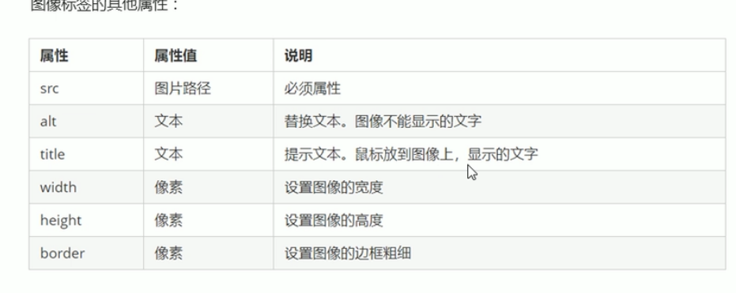
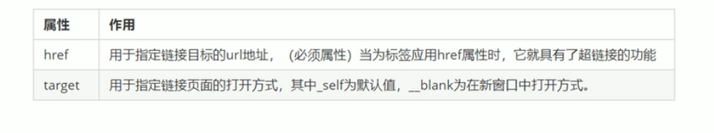
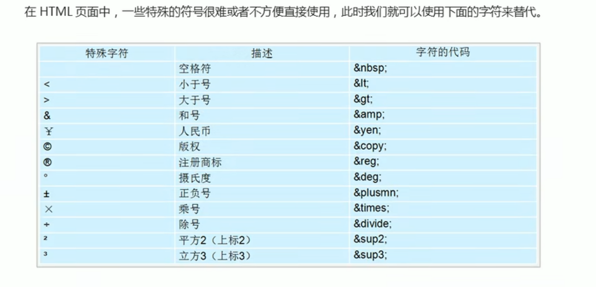

*he常用标签的学习*

**1  文档类型声明标签**

```java 
<!doctype html>
```

   表明当前版本采用的是哪个版本的HTML布局

注意：1 声明一定在最前面，早于<html>之前

​            2 它实际上不属于HTML标签。


**2 lang 语言种类**

```
<html lang="en">
```

en 英语界面

zh-CN 中文网页


**3 字符集**

<meta charset="UTF-8">

规定使用哪种编码方式


**4 标题标签     <h1到h6>**

一共六个等级。

```
从<h1>   到  <h6>
```

依据重要性逐级递减，1级最重要

 

**5 段落标签**

```
<p>和</p>
```


**6 换行标签**

```
<br />
```

HTML中的换行符，实现换行

 	**7 图像标签**

```

```


属性之间不分前后顺序，标签名和属性、属性和属性之间均用空格隔开

》

   **8 相对路径**

相对于图片文件的位置

1. 同级路径，直接写图像名即可，例如：
   src="im.jpg"
2. 下一级路径,需接文件夹名/，例如：
   src="img/im.jpg"
3. 上一级路径,需接../回到上一级文件夹中，例如：
   src="../im2.jpg"

**9 绝对路径**

1. 本地文件 src="C:\web\img\im.jpg"
2. 网络地址 src直接接图片连接

​    **10 超链接标签**

```
<a href="跳转的网站" target="目标窗口弹出方式"> 文本或图像 </a>
```



a href="#" 空连接

ahref="文件或者压缩包"，则会下载这个压缩包。

   **11 锚点连接**

```
<a href =#点位名称>  文本或图像  </a>
找到目标位置添加 id=“点位名称” 
```

12 注释标签和特殊符号

<!-- 这是一个注释标签 -->


