​                    

# CSS学习

#### 1 css概述

​    css是层叠样式表的简称。

   css语言也是一种标记语言。

  

#### 2 css语法规范

由选择器和声明组成。

写在head内

```
<style>


</style>
```

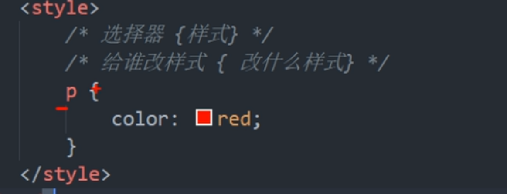


#### 3 css基础选择器

选择器 包括  **基础选择器** 和 **复合选择器**两部分

基础选择器包括：

1 标签选择器    2 类选择器 3 id选择器   4通配符选择器


 **3.1标签选择器**

就是用选择标签，作为css的对象


**3.2 类选择器** 

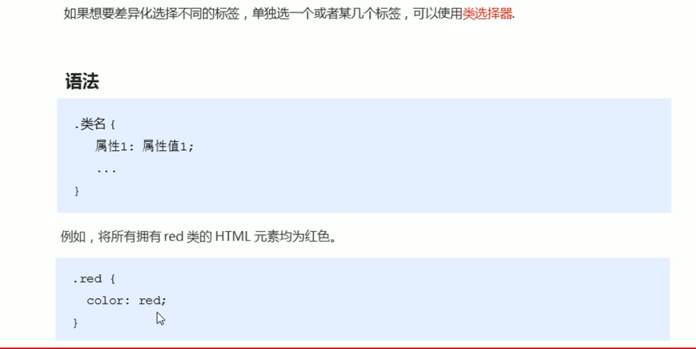

类的命名规则：

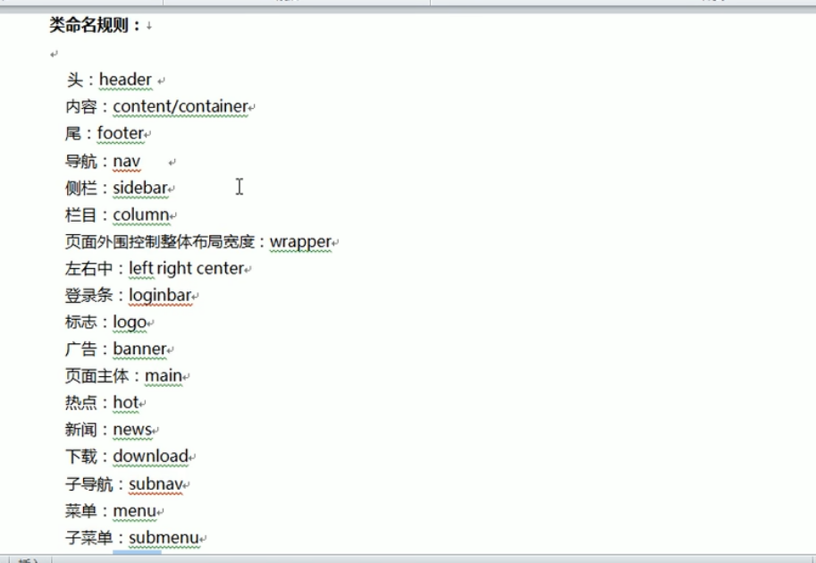

一个标签可以有多个类名 多个类名之间用空格隔开


**3.3 id选择器**

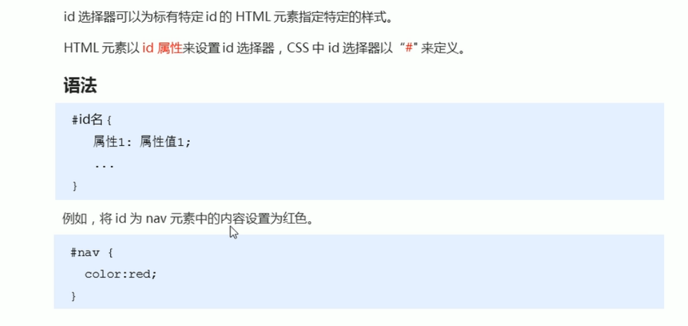

id只能被使用一次，是一对一的关系

当标签A已经使用了某个id时，别的标签不可以再使用这个id

  


​      **3.4 通配符选择器**

起到全选的作用

```
* {
  color= red
  width = 50px
}
```

​       


  **3.5 总结**

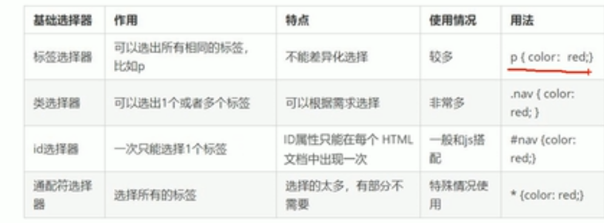


#### 4 css字体属性


**4.1 font-family 定义文本字体**

可以连着设置多个字体，若浏览器无法识别第一个字体，就会去接着读取第二个字体。


**4.2 font-size 定义文本字的大小**


**4.3 font-weight 定义文本字的粗细**


**4.4 font-style 定义文本字的风格（正常或者倾斜）**

normal 正常

italic 斜体


**4.5 font简写**

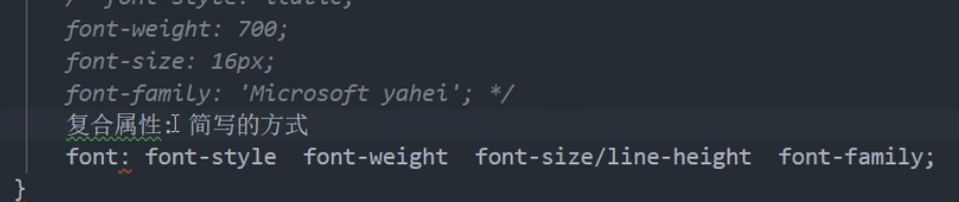

1 是否倾斜style 2文本字粗细weight    3大小size  4字体 family

顺序不能颠倒

style 和weight可以省略不写，但是size和family必须有


**4.6 总结**

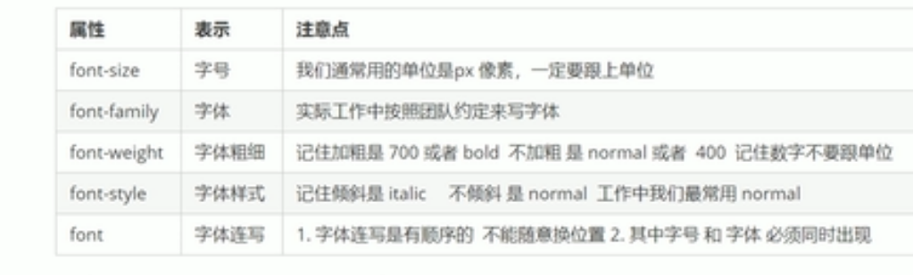


#### 5  css文本属性

定义文本的外观


**5.1 文本颜色color属性**

三种值：1**预定义的颜色** 

2 **16进制代码**（一般自己用调色板找） 

3**RGB代码**


**5.2文本对象 text-allgn**

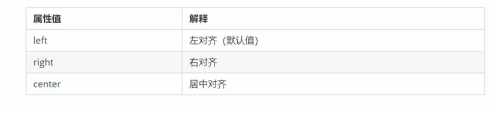

**5.3文本装饰 text-decoration**

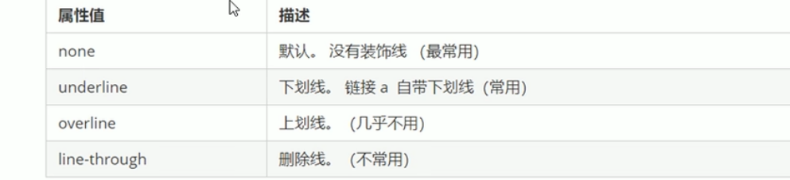

写的harf连接的文本一般都有下划线

此时可以选择这个连接 将它的text-decoration设置为none


**5.4 文本缩进  text-indent**

 

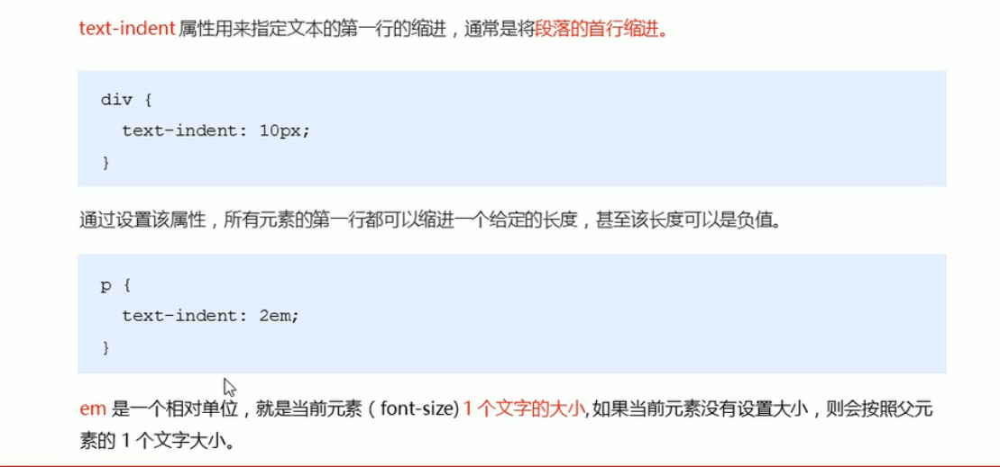


**5.5 文本行间距 line-height**

```
body
{
 line-height= 设定的间距长度 px
}
```

 **5.6 总结**

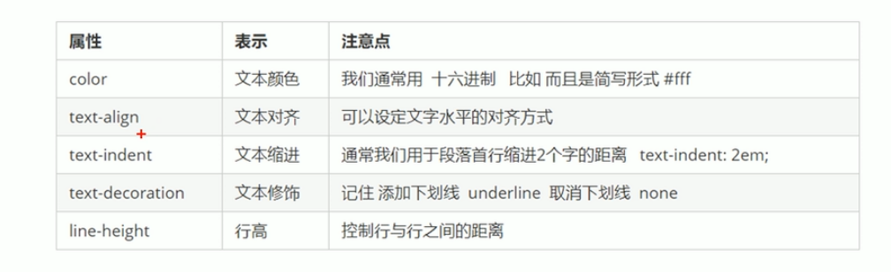


#### 6 内部样式表、外部样式表和行内样式表

 内部样式表：写在html文件中的head中，嵌入式，控制当前的HTML页面。

行内样式表：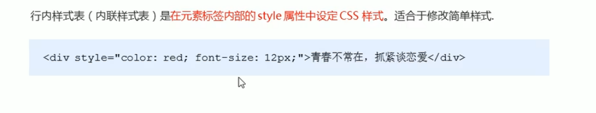

外部样式表：单独建立一个css文件，使用时引入HTML文件


引入方式：

```
<link rel="css文件名称" href=“css文件路径”>
（写在head中）
```

