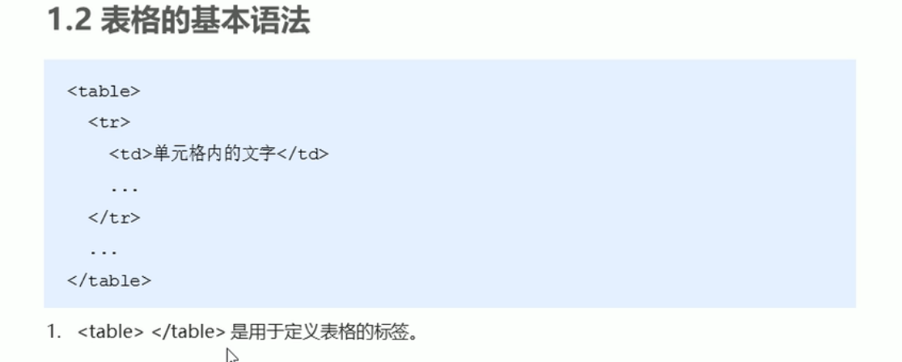
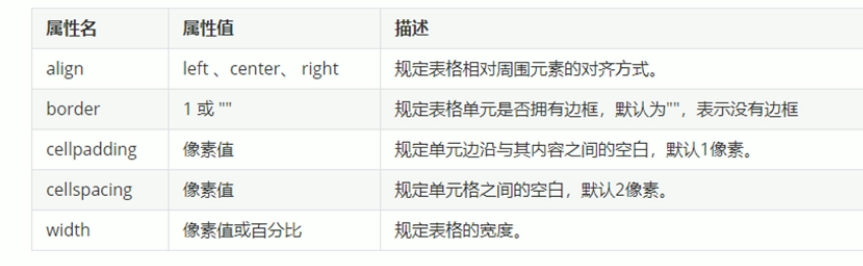
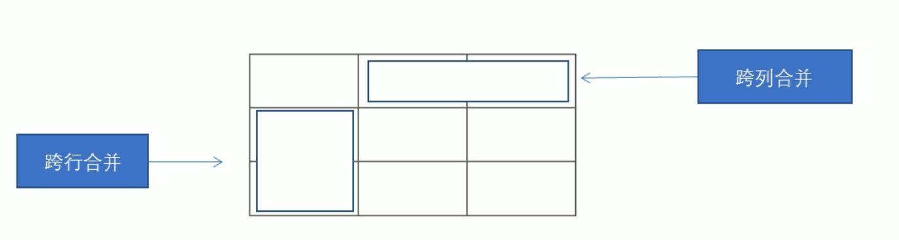
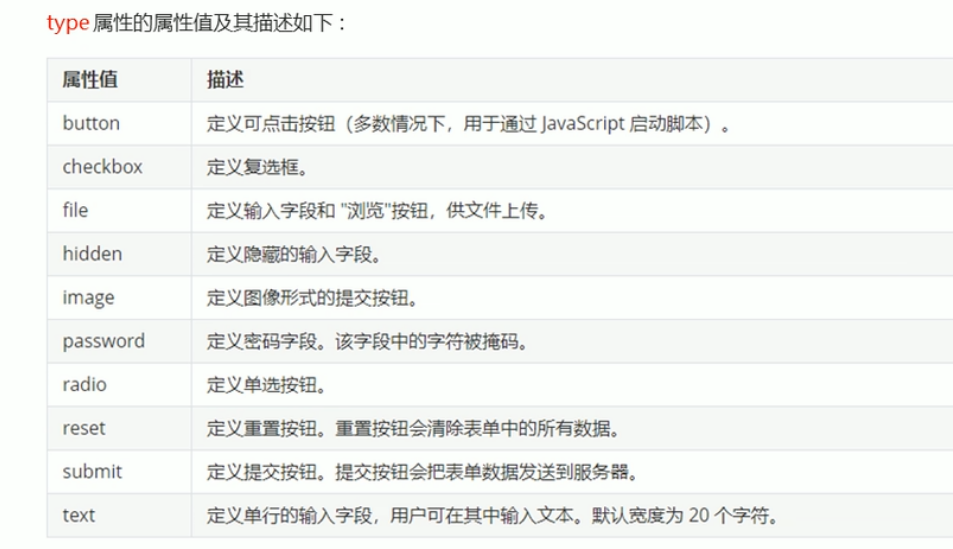

​                                                                                       **1 表格标签**      



**table是整个表格框**

**tr是table row**    代表一行

**td 是   table data**  代表这一行中一个单元格

  table中没有列的概念

<th>，table head 是表头单元格标签。（居中，加粗显示）

  表格标签中各项属性



合并单元格：

rowspan 跨行合并

colspan 跨列合并




​                                                             


​                                                                             **2 列表标签**

用 来 实 现  网 页 布 局

​                                                                         **2.1无序列表**

​                            

```
 <ul>
         <li>列表项</li>
         <li>列表项</li>
         <li>列表项</li>
         <li>列表项</li> 
 </ul>
```

​                各列表项之间无等级之分。

​                **ul** 里面只能放 **li**

​                   **li**    相当于空容器，里面可以放任何元素

​                                                                    


​                                                                      **2.2 有序列表**

```
<ol>
                 <li> 列表项   </li>
                  <li> 列表项   </li>
                   <li> 列表项   </li>
                   
</ol>
```

​            有序列表自带排序属性，其他和无序列表一样。


​                                                                    **2.3 自定义列表**


```
<dl>
     <dt> 名词A </dt>
     <dd>   名词A的解释1    </dd>
    <dd>   名词A的解释2    </dd>
    <dd>   名词A的解释3    </dd>
</dl>
```

   


​                                                                                           **3 表单标签**

   用来创建收集表

表单由三部分组成：表单域、表单元素、提示信息

​                                                                

​                                                             **3.1 表单域**

```
<form>
  
</form>
```

定义表单域 form会把其区域内的信息提交给服务器

form的相关属性

<table border="1" width="500" align="center">    <th> 属性</th><th>属性值</th><th>作用</th>    <tr><td>action</td><td>url地址</td><td>接收数据的服务器地址</td></tr>    <tr><td>method</td><td>get或post</td><td>数据的提交方式</td></tr>    <tr><td>name</td><td>名称</td><td>设置表单的名称</td></tr></table>

​                                      


​                                                **3.2 表单元素**

​                                       3.2.1 input 输入表单元素

```
<input type=“” 后加input属性>
```

​     单标签




<table border="1" width="500" align="center">    <th> input属性</th><th>属性值</th><th>作用</th>    <tr><td>name</td><td>自定义名称</td><td>规定input的名称</td></tr>    <tr><td>value</td><td>自定义数值</td><td>规定input中元素的值</td></tr>    <tr><td>checked</td><td>checked</td><td>规定此input首次加载时默认被选中</td></tr>    <tr><td>maxlength</td><td>正整数</td><td>规定input中输入字符串的最大长度</td></tr></table>

name和value是每个表单元素的必备值

单选按钮和复选框要有相同 的name值。

​                                         3.2.2   label标签

```b
 <label> for="对应的表单元素的id" </lable>
```

用于绑定一个表单元素，点击label的时候自动跳转到该表单元素

此时必须给对应表单元素设置一个对应的id

​                          


​                                                                       

​                                                           3.2.3 select 下拉表单元素

```
<select>
    <optipn>   </option>
    <optipn>   </option>
    <optipn>   </option>
    <optipn>   </option>
    <optipn>   </option>

    
<select>
```

定义下拉选项

<option>中可以定义selected="selected" 来设置默认选项

​                                                    


​                                                    3.2.4 textarea 文本域标签

```

```

输入内容较多的时候，使用textarea作为表单元素