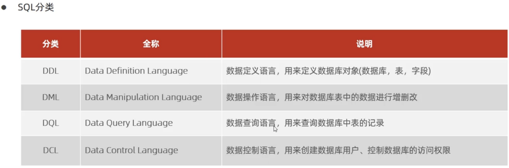

# mySQL语言学习W2

**1 mysql数据库**

属于关系数据库 由多张相互联系的二维表组成

 类excel表


**2 sql语言的语法**

1 sql可以单行或多行书写，分号隔开

2 sql语句不区分大小写 建议大写。

3 注释

```
单行：
         --或者#注释
多行：/*
           注释内容
     */
```




**3 DDL语句学习**

```
SHOW DATABASES ;--查询所有数据库
select DATABASE();--查询当前数据库
CREATE DATABASE [IF NOT EXISTS]数据库名称[DEDAUT CHARSET 字符集] [COLLATE 排序规则];
/*[]中可加可不加*/--创建数据库
DROP DATABASE [IF EXISTS] 数据库名字 ;/*[]中可加可不加*/ --删除数据库
USE 数据库名字; --使用数据库
```

DDL查询语句

```
查询当前数据库所有表：
SHOW TABLES;
查询表结构：
DESC 表的名字;
查询指定表的建表语句：
SHOW CREATE TABLE 表的名字
```

DDL  table的创建

```
CREATE TABLE 表的名字(
   字段1 字段1类型[COMMENT 字段1的注释],
   字段2 字段2类型,
   字段3 字段3类型

) [COMMENT 表的注释]

```

DDL 数据类型


DDL修改操作

 

```
添加表的字段：
ALTER TABLE 表的名字 ADD 字段名 类型 [COMMENT 注释]
修改字段数据类型
ALTER TABLE 表的名字 MODIFY 字段名字 新的数据类型
修改字段名和字段类型
ALTER TABLE 表的名字 CHANGE 旧的字段名 新的字段名 类型 [COMMENT 注释];
修改表的名字
ALERT TABLE 表达名字 RENAME TO 新名字;
删除表：
DROP TABLE [IF EXISTS] 表的名字;
删除指定表，并且重新创建该表
TRUNCATE TABLE 表的名字;
```

**4 DML语句学习**

 添加数据

```
给指定字段添加数据：
INSERT INTO 表名 (字段名1，字段名2，...) VALUES(值1，值2，...);
给全部字段添加数据
INSERT INTO 表的名字 VALUES (值1，值2,...);
批量添加数据
INSERT INTO 表名 (字段名1，字段名2，...) VALUES (值1，值2，...),(值1，值2，...),(值1，值2，...);
INSERT INTO 表的名字 VALUES (值1，值2,...),(值1，值2,...),(值1，值2,...);

```

插入时 字符串和日期类型数据应该保存在引号中


修改数据

```
 UPDATE 表的名字 SET 字段1=值1，字段2=值2,...[WHERE 条件]
```

如果没有条件，则修改所有数据


删除数据

```
DELETE FROM 表的名字 [WHERE 条件];
```

where不写就代表要删除所有的数据

总结


**5 DQL语句学习**

关键词：select


**基本查询**

```
SELECT 字段1，字段2,... FROM 表的名字;  有选择性得查询
SELECT * FROM 表的名字;   查询表的所有字段
SELECT DISTINCT 字段列表 FROM 表的名字;
```

 

**条件查询**

```
SELECT 字段1，字段2,... FROM 表的名字 WHERE 条件;  有选择性得查询
```

条件符号：


**聚合函数**

```
SELECT 聚合函数(字段列表) FROM 表的名字;
```

常见聚合函数


 


**分组查询**

```
SELECT 字段 FROM 表的名字 [WHILE 条件] GROUP BY 分组字段名字 [HAVING 分组后过滤条件]
```


**排序查询**


**分页查询**


**6 DCL语句学习**

用户管理语句

```
USE MYSQL;SELECT * FROM USER;        查询所有用户
CREATE USER '用户名'@'主机名' identified by '密码';    创建用户
只能在当前主机 用localhost 任意主机用%
ALERT USER '用户名'@'主机名' identified by mysql_NATIVE_PASSWORD WITH 新密码;       修改密码
DROP USER '用户名'@'主机名';                    删除用户
```


权限控制


```
SHOW GRANTS FOR '用户名'@'主机名';                             查询权限
GRANT 权限列表 ON 数据库名字 表名字 TO '用户名'@'主机名';          给予权限
REVOKE 权限列表 ON 数据库名字 表名字 FROM '用户名'@'主机名'        撤销权限
```

