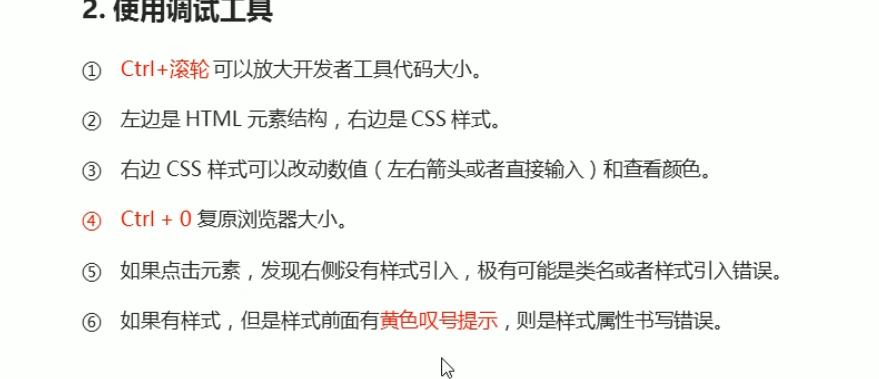
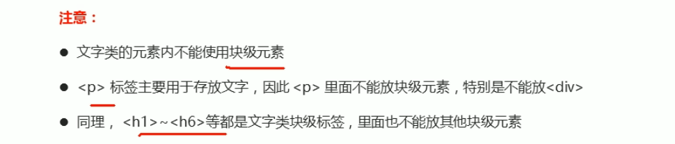
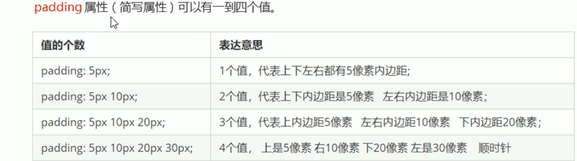
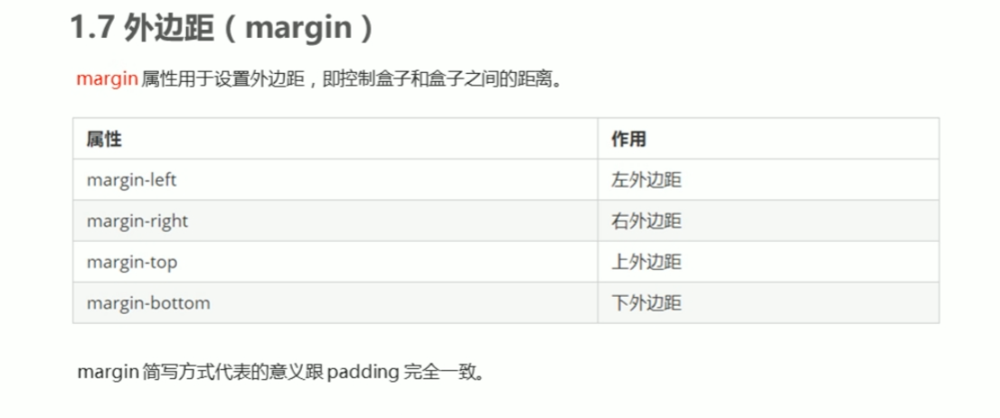
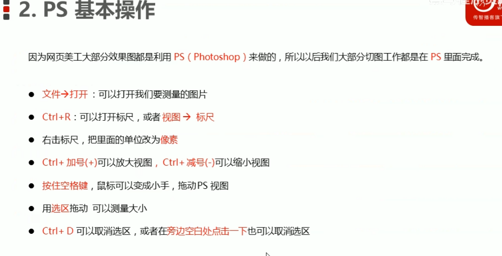
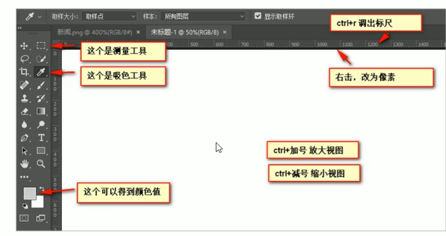
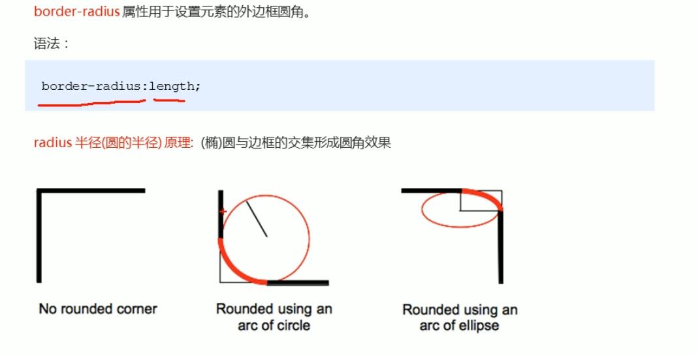
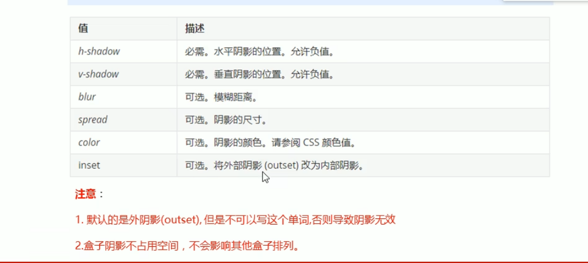
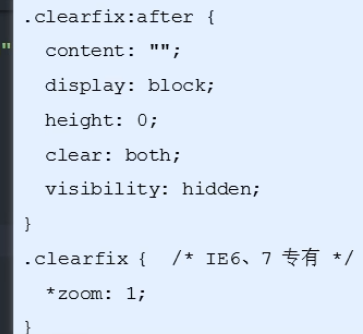

#### **1 Chrome自带调试器的使用**

​                 右键＋检查进入




#### **2 Emmet语法**

 快速生成HTML标签

```
1 快速生成标签:
  标签名+tab键
  
2 快速生成多个标签
  标签名*3+tab  生成三个
  
3  父子关系标签 >
   例如：ul>li


4 生成兄弟关系标签 +
例如：div+p

5 生成带有class或者id的 .或#名称 +tab键

6如果生成的div类名是有顺序的，可以用自增符号

7 标签内部书写内容可以用{}表示。
```


快速生成CSS样式：

关键词＋tap键

```
tac  内容居中
ti2 设置首行缩进为2
w100 设置宽度100
h100 设置高度100
tdn  去下划线
```


#### **3 格式化代码**

在IDEA 中使用     **ctrl+alt+L**


#### **4  CSS复合选择器**


##### **4.1**后代选择器: 

 选择父元素里面的子元素  比如ol或ul里面的li

```
ol li
{

}

或者

ul li
{

}
```

格式：

```
父元素 子元素

{

 }
```

可以层层迭代或全选后代元素：

```
父元素>子元素>孙元素

{

}


父元素 孙元素
{

}
```


##### **4.2并集选择器**：

逗号分割 

```
元素1,元素2
{

}
```


##### **4.3伪类选择器**

选择一些特殊状态的元素

书写特点  用：表示

###### 4.3.1 链接伪类

```
a:link                 /*   所有未被访问的连接          */
a:visited                 /*   所有已经被访问的连接          */
a:hover                 /*   鼠标悬停上的连接          */
a:active                 /*   鼠标按下未弹起的链接         */
```

注意事项：

 按照LVHA顺序写


###### **4.3.2 focus伪类**

选择被光标选中的那个input

```
input:focus {

}

```


#### 5 行元素和块元素

##### **5.1块元素**

独占一行  常用div

高度 宽度 内外边距都可以设置

都属于一个容器，里面可以放各种元素。




##### **5.2 行内元素**


常用span  a   一行可放多个

 无法设置宽和高

默认宽度就是本身内容的宽度

行内元素内部不能放块元素


##### **5.3 行内块元素**

特殊 如img td input等

一行可放多个 但是可以设置宽和高。


#### 6 元素显示模式的转换

应用：增大链接a的范围


格式

```
a
{
display:block /*转化为块元素*/
display:inline /*转化为行内元素*/
display:inline-block /*转化为行内块*/
}
```


#### **7 单行文字在盒子里垂直居中**

让文字的行高等于盒子的行高

```
hight: 50px;
line-hight:50px;
```


#### 8 css设置背景

```;
 background-color:red;   /*设置背景颜色
  background-image: url(img/genshen.png);   /*设置背景图片
  
 background-repeat: no-repeat;
 background-repeat: repeat;
 background-repeat: repeat-x;
 background-repeat: repeat-y;
 四个参数决定是否背景平铺
 
 
 /*设置背景图片位置*/
  background-position: center top; 可以跟方位名词(一个或两个)
  
  
  background-position: x坐标 y坐标    跟具体像素单位
  
  /*  方位和像素单位可以混用*/
  
  background-attachment: fixed;
  /*  背景图像不滚动 固定  */
  
  
  总和简写：
  background: transparent url(hhh.jpg) no-repeat fixed top left;
  
  
  背景色半透明
  background:rgba(0,0,0,0.3)
  前三个都为0 最后一个为透明度 1为全黑 越小越透明  
```


#### 9 Css三大特性

  

##### **9.1    重叠性**

就近原则 冲突时写的最靠近的生效


##### **9.2 继承性**

子元素可以继承父元素的某些样式

text-   font- line- 和color可以继承


##### **9.3  优先级**


```
!importan>行内样式>id选择器>类选择器>元素选择器>继承的
```

!important 用法

```
div{
color:red!important;
}
```


复合选择器 权重值的叠加：


**将单权重值进行叠加**后比大小

权重叠加时不用考虑进位的问题


#### **10 盒子模型**

组成  border边界   context内容  padding 内边距  margin 外边距


##### 10.1 border部分

```
 border-width: 5px;  设置边框的粗细度
 
 border-style: solid;  设置为实线边框
 border-style: dashed;   设置为虚线边框
 border-style:dotted ;   设置为点线边框
 
  border-color: green;设置边框颜色
  
  简写
   border: 3px solid yellow;
   
   
 只设置一条边：
   border-top: green;
   border-bottom: purple;
   border-left: blue;
   border-right: black;
   
   
如果有两个边框相邻 将两个边框合并成一个边框：
 border-collapse: collapse;
```

边框是嵌套在盒子外面的 它会使盒子看起来变大

不影响文本在盒子中的位置。


##### **10.2 padding内边距部分**

指盒子的内边距

在盒子里面 影响文本的位置



padding 实际上会影响盒子的实际的大小。

特殊情况：box没有指定height和width 此时padding不会影响盒子的大小。

应用：

某些并列项的字数不一样多，设置box的宽度看起来不是等距离的

此时不设置box的width  而设置padding 可以使其等距。


##### **10.3 margin外边距部分**



**应用：使块级的盒子水平居中**

```
margin: auto;
```


行内元素或者块元素水平居中：

给父元素设置

```
text-align:center
```


**外边距 父子元素的嵌套塌陷问题**:

父元素和子元素都有margin值

此时父元素会塌陷二者中较大的margin值

 解决方案:

```
1 父元素定义边框border:
border: 1px transparent solid;

2 父元素设置内边距：
 padding: 1px;
 
 
3 父元素添加：
overflow：hidden;
```


##### 10.4 清除内外边距

```
* {
margin: 0px;
padding:0px;
}
```


#### 11 PS的使用






#### 12 list 样式的去除


```
li:
{
list_style:none;
}
```


#### 13 圆角边框

```
borderborder-radius: 50px;圆角边框

borderborder-radius: 50%;  圆形

```




#### 14 盒子阴影




```
  例如：
  box-shadow: 10px 10px 15px 10px rgba(0,0,0,.3);
```


#### 15 文字阴影

```
   text-shadow: 10px 10px 5px rgba(0,0,0,.3);
   
   
   水平阴影的位置  垂直阴影的位置 模糊距离  颜色
```


#### 16  浮动float流

​     典型应用：让多个块元素放在一行中去显示

网页布局：多个块元素纵向排列 用标准流

​                    多个块元素横向派来 用浮动流

用法：

```
选择器{
float:none;
float:left:
float:right;
}
```

float用于创造浮动框，将该元素移动到浏览器的一边或者挨着另一个浮动框框


##### **16.1 float特性：脱标**

float的元素不会保留其位置

和标准流的元素可能会重叠在一起


##### **16.2 float特性**


如果多个盒子都设置的浮动，它们会在一行排列 并根据盒子的上沿对齐。

如果父级元素装不下这些浮动的盒子，多出的盒子会另起一行对齐。

 float元素具有行内块元素的特性。

**块元素默认和父元素一样宽**

**但是变为float时候如果不设置宽度 则根据内容大小决定宽度**

盒子之间没有缝隙。


##### **16.3 **使用方法

**网页布局一般使用大的标准流父盒子 里面嵌套浮动流子盒子**

****


##### **16.4 注意**

1 float流要在父元素标准流中进行

2 同一级别的元素，如果浮动，要一起浮动。


## 17  清除浮动.

适用于父元素的长度处于不定态的情况下

```
选择器：
{
clear:both;
}
```

**方法1：额外标签法：**


```
在浮动元素末尾加一个标签
。clear:
{
clear:both
}


<div class="claer">

</div>
```


**方法二：父元素overflow**

将overflow设置为hidden


**方法三：after伪元素**

