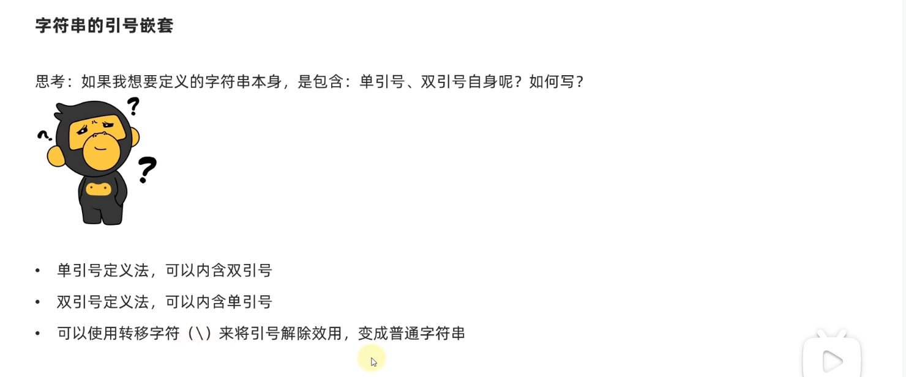
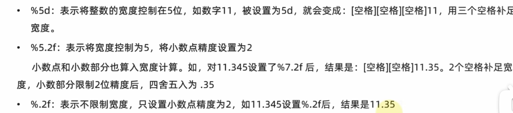
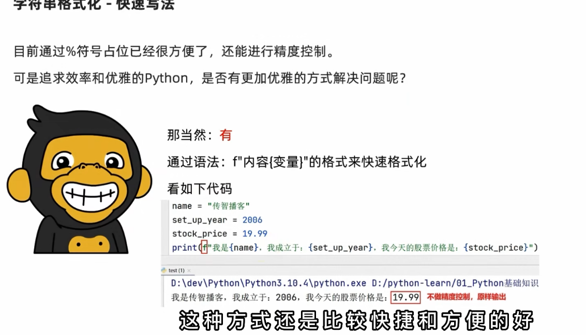
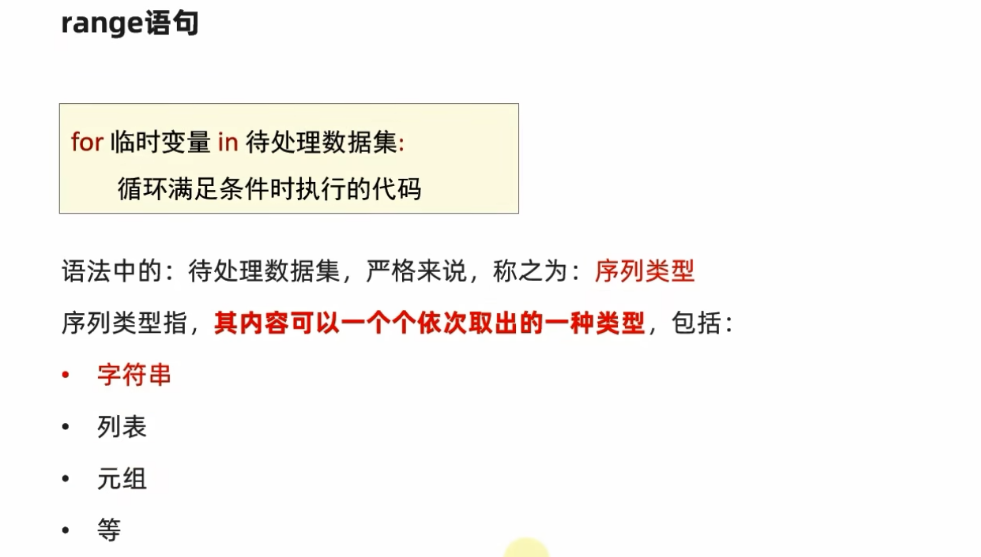
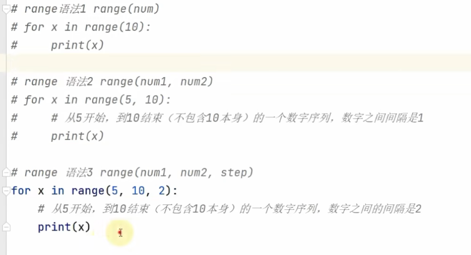
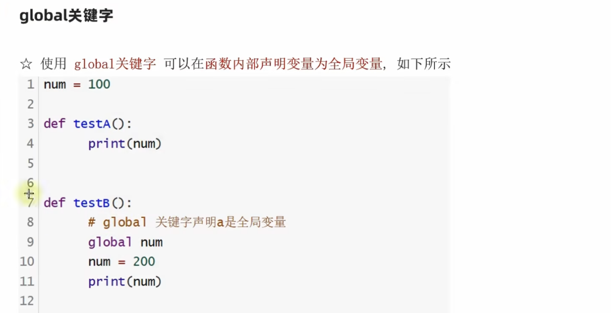
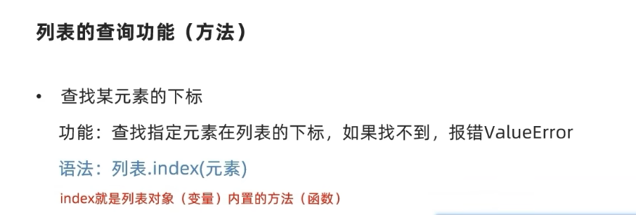
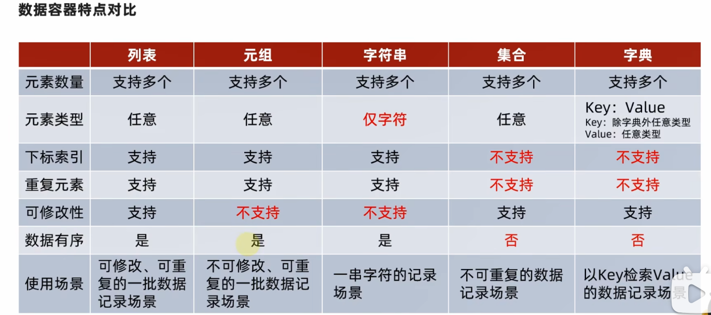
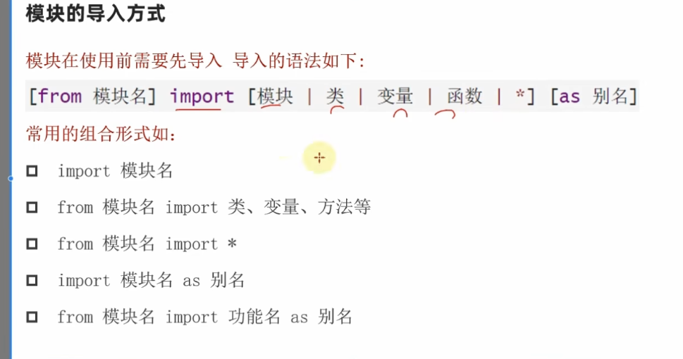

 

# Python W3学习

### 基础语法

```python
输出：
print("hello world");


单行注释：# 单行内容

多行 : """ 
        注释内容

      """
    
    
数据类型转换:
    int (x ) 浮点转换  去尾法
    float(x)
    str(x)
    进行数据类型转换
    
    
    
    
Python属于大小写敏感型语言


运算符：
//      取整除
**      指数  2**5 2的五次方

""" 
三引号多行注释法
"""
可以定义一个能接收多行内容的string类 （即可以包含回车）

```



```
字符串格式化：
name="lb"
print("我是 %s" % (name))
%s string %d 整数 %f浮点数


```


精度控制







```
数据输入：
name=input("这是一条提升信息，请输入你的名字")
输入的都是str类型数据 
```


```
条件判断
if 条件：
    执行语句1
elif 条件：
    执行语句2
else 条件：
    执行语句3
    
    
    
# python 是通过空格缩进来判断语句的归属的

```

```
循环
while 条件:
    执行语句
    空格缩进还是四个。
```

```
输出换行：
print("内容")

输出不换行：
print("内容",end="")
```

```
/t 
可以实现多行字符串自动对齐
```


```
for循环：
for i(临时计次数的变量)  in data(要被处理的数据)
将被处理的数据一个一个地取出，并赋予给临时变量i
```






### 函数的定义

```
def 函数名(参数)：
    执行语句
    return 返回值

```




### 数据容器  list：

```
my_list=[12,true,"hello"]
list型可以存储任何类型的元素
下表索引从0开始

插入：
my_list.insert(1,"hh")
在list中的索引1 处插入“hh”

添加：
my_list.append("cnm")
list尾添加“cnm”

删除：
del my_list[2]
my_list.pop(2)
删除第三个元素

my_list.remove(需要删除的元素)
从前到后删除查到的第一个元素

清空：
my_list.clear()


查询次数：
my_list.count(5)
查找list中有多少个  元素5

表长：
len(my_list)

```




### 数据容器 元组 tuple

```
不可修改的list
定义元组：
tuple1=(1,"nihao",True)
tuple2=tuple()
tuple3=("nihaoa",)
元组里面只有一个元素，要在这个元素后加个逗号
元组也可以进行嵌套
常用方法：
tuple.index()    tuple.count
常用函数:
len(tuple)

 遍历：
 for element in ruple:
 
 元组自己的元素不可修改
 但是如果内部嵌套了可修改的容器
 那么内部容器可以被修改
  
  
  

```


### 数据容器 字符串 str


 

```
字符串不可修改（read only）
常用方法：
str.index()
str.replace("abc","efg")  """将字符串中的所有abc换成efg 不是修改，而是得到昕字符串“”“
str.split(”分割的点“)：

例： str1="abcefgabcbbbba"
    newstr=str1.split("b")
    print(newstr)

    output：['a', 'cefga', 'c', '', '', '', 'a']


str.strip()
去除字符串前后的空格和回车（字符内部的不会被去除）

str.count()
len(str)
```

序列（list，tuple ，str）的切片：

例：

```
list[0:5:1]
得到一个新的序列

从list[0]到lsit[4]切片得到新序列，步长为1.

list[ : :1]

不写代表从头到尾

list[ : :-1]

倒着写(实现序列的颠倒)
```


### 数据容器 集合 set

```
使用{}定义
set  无序，去重的
常用方法：
set.add() 添加
set.remove() 删除
set.clear()  清空
set1.difference(set2)  取差集
set1.difference_update(set2)  将集合1 中的差集删去，更改set1，set2不变
set1，union(set2)  集合的合并
len(set) 长度


```


### 数据容器 字典 dict

创建哈希表 实现对应

```
dict1=("bob":123,"ann":203)

key不可重复，value可以重复


嵌套字典可以实现表格（二维dict）

dict1["jack"]=90
新增键值对或者更新键值对

pop["jack"] 弹出并删除这个键值对

dict1.clear () 清空功能


dict1.keys()  得到全部的key

字符串遍历
my_key=dict1.keys()
for k in my_key:
    print(f"key是{k}，value是{dict1[k]}")
    
    
长度：
len(dict)
```




容器转换：

```
list() 
tuple()
set()
str()
```


排序函数：


```
sorted()
排序后生成一个排序后的list
```


多返回值  之间用逗号隔开 支持不同类型的数据

```
def hanshu():
    return 1,4

x,y=hanshu()


```


传参 中 的缺省参数

```
def usermsg(name,age,gender="男")


如果不传入，就按默认值传入。
```


传参 中 的不定长参数

```
def user_info(*args):
    print(args)
    
    
注释：
传入的所有参数都会被args收集，args就是一个元组tuple
一个*号
```


```
def user(**args)
   print(args)
user(name="lee",age="19",gender="man注释：
传入的所有参数都会被args收集，args就是一个元组tuple
一个*号")
   
注释：
传入的所有参数都会被args收集，args就是一个字典dict
两个*号   

```


### 匿名函数

python可以将**函数作为参数调用**

```
def add(compute):
    result=compute(1,2)
    print(result)
    
def compute(x,y):
    return x+y
    
```

属于一种计算逻辑的传递

  


lambda 匿名函数关键字

 ```
lambda 传入的参数: 函数体（只能写一行）


def add(compute):
    result=compute(1,2)
    print(result)
lambda x,y:x+y
 ```


## PYTHON的文件操作 

##### **打开文件** 

 open(name,mode,encoding)函数

name:文件名（可以包含具体路径）

mode:打开文件的模式（只读（r），写入（r）或追加（a））

encoding：编码格式（推荐UTF-8）

 ```
t=open("文件.txt","r",encoding="UTF-8")

 ```

encoding必须要写


##### **阅读文件**

read()方法 返回str

```
文件对象.read(num)
```

num指定读取的数据的字节长度，如果没有num，就是全读


readlines()方法  返回list

把文件内容一次性读取并返回list 每个元素就是str型的每行的内容

read和readline每次读到哪里，下次再用的时候会接着读

```
t=open("ppp.txt","r",encoding="UTF-8")

print(t.read())
print(t.readlines())
```

这样的话每次要read类去读文件都要重新去open


##### **关闭文件**

```
t.close()
```


##### **自动关闭文件**

```
with open("ppp.txt","r") as f:
    f.raed()
```

会自动关闭


##### **写入文件**

write方法

```
t.write("world hello")
```

先写入缓冲区

```
t.flush()
```

再flush到硬盘中

两步操作避免一直操作硬盘


##### **追加文件**

和写入文件操作相同

在open的时候将mode换为“a"


## 异常捕获

##### 捕获常规异常：

```

try:
    可能出错的代码块
catch：
    如果出现异常要执行的代码块
   
```


##### 捕获特定异常：

```
try:
    代码
except 异常类型 as e:
    出现异常要执行的代码块
    
```


##### 捕获多个异常

```
try:
    代码
except (异常类型1，异常类型2) as e:
    出现异常要执行的代码块
    
```


##### finally 关键字

```
无论异常是否出现都要执行
```


##### 结构：


```
try:

except:

else:

finally:

```


## 模块的使用


```

```




模块的自定义：

正常写一个py文件

在另一个文件中import这个文件


## 包的使用

package 包含了许多模块

导入方法

```
import 包名.模块名
```

调用

```
包名.模块名字.函数名
```


## 数据可视化


##### **json和py的转换**

不同编程语言的数据进行转换的中间形式

转换方法：

```
import json
data=[{"name":"lee","age":"19"},{"name":"ma","age":"1"}]

data=json.dumps(data)
print(type(data))

python 转json

data=json.loads(data)
print(type(data))

json转python
```


