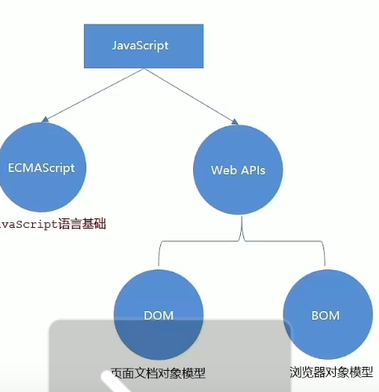

# JS学习

### 1 js简介

运行在浏览器上的编程语言

实现：

网页特效 表单验证 前后端数据交互  服务端编程




### 2 js书写位置：

行内 内部 外部

**内部**：

在body内书写

写在body的最下方内


**外部：**

 写在  .js 文件中

引用：

```
<script src="XXX.js">

</script>
```

**内部和外部不能混着用**


### 3 JS语法和常用函数

##### 3.1 注释和结束符

```
//  单行注释

/* 
      多行注释
*/
```

结束符是 ;  但是可以不写


##### 3.2 输入和输出

```
1  document.write("")

   引号内容里面可以直接写标签（使用html语言）


2 alert("")
   弹出警告提示框
   
3 console.log(" ")
控制台打印


输入：
prompt("你是gg还是mm？？")
```


##### 3.3 执行顺序

自上而下依次执行渲染

**但是alert和prompt会被先执行**


##### 3.4 变量

```
let 变量名


js是大小写敏感的语言
```


##### 3.5 数组

```
let arr=[10,20,30]
  索引 从0开始
  
let arr= new Array(1,2,3)


修改：
arr[1]=300

增加：
arr.push(5,11)
添加到数组末尾  该方法返回值为 新数组的length

arr.unshift(8,"nihao")
添加到数组开头 该方法返回值为 新数组的length

遍历：
for(i=0;i<arr.length;i++)
{
  循环体
}

删除：
arr.pop()
从队列末尾弹出一个元素并返回

arr.shift()
从arr头部弹出一个元素并返回


arr.splice(起始索引，删除的元素数量)
2个参数  索引从0开始
```


##### 3.6 常量

```
const G=9.8
```


##### 3.7 数据类型

```
类python 弱数据类型

NaN：计算错误
NaN是粘性的 任何对NaN的操作都会返回NaN


外双内单，或者外单内双
必要时可以使用转义符\ 

字符串拼接：  str1 + str2  (字符串也来可以和数字型一起拼接)
```


#####  3.8 模版字符串

```
document.write(`我今年${age}岁了`)


 ${}内写变量    使用斜括号  ` `
```


##### 3.9 typeof()

```
let num="你好“
console.log(typeof(num))
```


##### 3.10 类型转换函数

```
newstr=Number(str);

newstr=  parseInt(str)  只保留整数部分 

newstr=  parseFloat(str)
```


##### 3.11 运算符号

```
==  左右的值是否相等
===  左右的类型和值是否都相等
!==  左右两边是否不全等


 console.log(2=="2")    ture
  console.log(2==="2")  false
  console.log(2!=="2")  ture
```


##### 3.12 选择和循环


C-like  和c一样


### 4 函数操作


##### 4.1 封装

```
function 函数名()
{

}
```


##### 4.2 变量名重复

优先调用函数内的那个变量

逐层查找


##### 4.3 匿名函数

```
function()
{

}
```

常用操作：

1 函数表达式

```
let fn=function()
{

}
```

相当于一种 特殊的类


2 立即执行函数

```
  (
        function (a, b) {
            console.log(a + b)

        }
        (2, 100)
    )
```

匿名函数第最外层括号后面一定要  **加分号**

在括号内先声明再调用


3 逻辑中断

利用&&和||实现（c-like）


```
&& 左边false  右侧代码不再执行。

||  左边true 右侧代码不再执行。

 console.log(11||22)  //两侧都ture 返回左侧
 console.log(11&&22)   //两侧都true 返回右侧
```

从而为函数添加默认值

 例：

```
 function  sumage(fage,mage)
    {
        let  f=fage||27
        let m=mage||25
        return f+m


    }
    let fage=Number(prompt("父亲年龄？" ))
    let mage=Number(prompt("母亲年龄？"))
    let ans=sumage(fage,mage)
    document.writeln(`年龄之和为${ans}`)

```


**4.4 Boolean型转换**

```
let newboolean= Boolean(NaN)
```


''、0、undefined、null、false、NaN 都是false

''和null数字转化后是0

undefined数字转换后是  NaN


### 5 对象

##### 5.1 基本操作

```
声明：
let obj={
h:500,
w:500,
name='123'

}

增改 直接进行
原来有就是 修改操作
原来没有 就是增添操作


删除：
delete obj.name

查询：
console.log("obj.name")
或者
console.log("obj['name']")
```


##### 5.2 声明方法

```
let obj=
{
act1:
      function()
      {
      函数体
      }
}
```


##### 5.3 对象内部的遍历

```
类py、
for(let k in obj)
{
循环体
}


```

例子：

```
 let obj={

      name:"123",
      hi:2,
      w:300,
      say:
      function ()
      {
          for (let it in obj)
          {
              console.log(`这是${obj[it]}`)
          }
      }
  }
```

可以对象内部 **for in 对象本身**


### 6  内置对象 js包

####    6.1 math包

```
 ma=Math.random()    /* 生成0 到1 的随机数 包括0 不包括1*/
 ma=Math.ceil(ma)    /* 向上去整*/
 ma=Math.floor(ma)   /* 向下去整*/
 ma=Math.max(1,23)   /* 求最大值 可以调用数组*/ 
 ma=Math.pow(2,10)   /* 幂运算  2的十次方*/ 
 ma=Math.abs(-100)   /* 绝对值*/
```


取随机数

```
    ma=Math.floor(Math.random()*1024)
    /* 取0到1024 之间的随机整数  不包括1024  */
    
    
    ma=Math.floor(Math.random()*512+512)
      /* 取512到1024 之间的随机整数  不包括1024 */
```


### 7 JS  API

##### 7.1 let和const的选择

开发中一般先使用const

 遇到需要更改的变量再修改声明为let

```
const arr=['123','147']

const obj={
age:18,
gender:'man'
}
```

数组和对象obj' 使用const声明

可以修改内部的内容。


##### 7.2 DOM常用方法

###### 7.2.1  document.querySelector( )

```
 const boxhd=document.querySelector('.box-hd')
  
 //  获取 匹配到的标签选择器所对应的第一个标签
 
 参数：CSS选择器字符串  返回值：css选择器所匹配的第一个元素对象
```


###### 7.2.2 **document**.querySelectorAll()

 参数：CSS选择器字符串  

返回值：css选择器所匹配的所有元素对象组成的 NodeList

 `NodeList` **不是一个数组**，是一个类似数组的对象 (*Like Array Object*)。

**可以使用索引号 但是没有pop和push等方法**


###### 7.2.3   对象.innerText

innerText 就是所设置的box中的文字内容

```
 const box1=document.querySelector('.one')
 console.log(box1.innerText) //输出文字内容
 box1.innerText="hello world"  //修改文字内容
 console.log(box1.innerText)
```

只修改文字  不解析标签


###### 7.2.4 对象.innerHTML

可以解析标签

```
  box1.innerHTML = '<h3>你好 世界 </h3>'
```


##### 7.3  选取对象的css样式更改

方法一：通过.style.css属性来更改

```
 box.style.backgroundColor='pink'
 box.style.height='50px'

```

方法二：先在css中预载样式设置

在script执行的时候  进行判断 条件满足就修改  对象.className 从而实现渲染

例如：

```
 <style
        .tibu
        {
            background-color: steelblue;
            height: 50px;
            line-height: 50px;
        }
  </style>
  
  
  
  <script>
  if (people[ans]==='jack')
    {
        w3.className='tibu'
    }
  </script>
```


方法三 ：classList方法实现 类名的添加  **(同时不覆盖之前的类名)**

例如：

```
 w3.className='ti'
    if (people[ans]==='jack')
    {
        w3.classList.add('tibu')
    }
```

classList的常用方法：

```
box.classList.add('tibu')  添加类名
box.classList.remove('ti')  删除类名
box.classList.toggle('ti')  list中有ti 删去 ，没有ti则加上
```


##### 7.4   操作表单元素

获取表单元素值

```
const pass=document.querySelector('div input') console.log(pass.value)
```


##### 7.5 自定义属性


自定义

```
<div class="make" data-id="不知道">
```


调用：

```
 const itt=document.querySelector('.make')
 console.log(itt.dataset.id)
```

**itt.dataset.id**


##### 7.6 定时器-间歇函数

实现代码的重复执行

常用方法

###### 7.6.1 打开定时器

```
let 变量名 = setInterval(执行函数,间隔时间 单位：ms)
```

函数后面不用跟括号带参数


###### 7.6.2 关闭定时器

```
clearInterval(变量名)
```


### 8 伪类选择器 :nth-child()


### 9 事件监听器

##### 9.1 语法

```
元素对象.addEventListenner('事件类型',执行函数)
```


##### **9.2 事件类型**

**mouse类：**

```
btn.addEventListener('click',down)
//鼠标点击
btn.addEventListener('mouseenter',begin)
//鼠标经过
btn.addEventListener('mouseleave',begin)
// 鼠标离开
```


**表单光标类**

```
focusing.addEventListener('focus',begin)
//表单获得光标

focusing.addEventListener('blur',begin)
//表单失去光标
```


**键盘类**

```
keyboard.addEventListener('Keydown',begin)
// 键盘按下触发

keyboard.addEventListener('Keyup',begin)
// 键盘抬起触发
```


**文本输入类**


```
textArea.addEventListener('input',begin)
// 用户输入 触发

```


### 10 事件对象

##### 10.1调用方法：

在function里面 声明

一般将事件对象声明为e或者evt

```
input.addEventListener("input",function (e){
    len=input.value.length
    ale.innerHTML=`您一共输入了${len}/20字`
    if(len>20)
    {
        ale.innerHTML=`超出字数限制`
    }
    console.log(e)
})
```


##### 10.2 常见属性

```
console.log(e.type)
//事件的类型 例如是点击click还是input输入

console.log(e.clientX)
// 这个事件发生时在页面的X坐标

console.log(e.offsetX)
//事件发生点在当前dom元素内部的X坐标

console.log(e.key)
//这个事件发生的所带按下的键盘的值  适用于 键盘类
```


### 11 trim函数 的字符串处理

**trim()函数**

**删除字符串两侧的空格**


### 12 环境对象 this

**谁调用 this就指向谁**


### 13 事件流

##### 13.1 定义 

事件流指的是事件完整执行过程中的流动路径

事件捕获 从大到小  从父到子

事件冒泡 从小到大 从子到父


##### 13.2 捕获使用方法

```
DOM.addEventListener('click',function (){},true)

```

第三个参数 默认false 代表事件冒泡  传入true 则实现事件捕获。


**捕获相当于 父、子元素绑定的监听器在执行的时候从大到小执行**

**冒泡相当于 父、子元素绑定的监听器在执行的时候从小到大执行**


##### **13.3  阻止冒泡**和捕获

先拿到事件对象

```
事件对象.stopPropagation()
```

例子：

```
boxsmall.addEventListener('click',function(e))
{
e.stopPropagation()
}
```


##### **13.4 事件解绑**

```
ball.removeEventListener('click',fn)
```

第二个参数是函数名称

因此匿名函数作为addEventListenner的时候 无法进行事件解绑。


### 14 事件委托

利用事件流的特性

将监听器绑定在父元素上 减少注册次数 提高效率

**如何定位 事件是发生在哪个子元素上？、**


**查询事件 e里面的target元素**

**对target元素进行操作**

**同时利用target里面的tagName属性进行if判断**

```
if(父元素.target.tagName==='LI')
{
执行代码
}
```

可以精准界定哪些子元素会发生事件响应。


### 15 阻止默认行为

 **语法 **

**e.preventDefault()**


阻止某些元素的 常规默认行为。


### 16 其他事件


##### 16.1 页面加载事件

等待页面所有对象都加载完后再执行的事件


```
windo.addEventLinster('load',function(e){

需要执行的代码块

})
```


等待初始的HTML文档被完全加载后执行的事件

属于document的属性

语法：

```
document.addEventListener('DOMContentLoaded',function(){

})
```

不需要等待样式表和图片加载完毕


##### **16.2 元素滚动事件**

页面滚动的时候触发的事件

一般给document或者window添加

语法：

```
window.addEventListener('scroll',function (){
    
})
```


scrollTop和scrolLeft属性

**是可读写的 默认单位是px像素， 读写的时候不带单位**

返回被卷向上和向左的距离。

利用  if 语句进行操作

例如：

```
window.addEventListener("scroll",function (){

    if(document.documentElement.scrollTop>=500)
    
        console.log("nononononon")
        
})

```


##### 16.3 页面尺寸事件

窗口尺寸页面发生变化的事件

语法：

```
window.addEventListener('resize', function () {
    console.log("hello")
})
```


clientWidth 和clientHeight 

获取元素的可见部分的宽和高

（不包含边框，margin和滚动条等）


offsetWIdth 和offsetHeight

 包含元素自身设置的宽高，padding和border

获取出来的是数值 方便计算


offsetLeft和offsetTop

获取元素距离自己 的**带有相对定位 的更高级元素**的左、上距离


### 17 日期对象

创建

```
const  date=new Date() //当前时间


const dateFinal=new date('2023-10-1 08:00:00')
//指定时间
```


对象常用方法：

```
const year=dateFinal.getFullYear()
//获取四位数年份
const month=dateFinal.getMonth()
//获取月份 
注意取值是0-11  要+1
const dayInMonth=dateFinal.getDate()
//获取日期 今天是几号
const day=dateFinal.getDay()
//获取今天是周几
注意取值是0-6  要+1


还有.getHours() .getMinutes() .getSeconds()等常用方法。


const time=date.toLocaleString()
//获取格式化的年月日
```


时间戳：

应用：倒计时效果

倒计时=截止日的时间戳 -现在的时间戳  单位：毫秒

在转化为年月日时分秒的形式即可

调用：

```
Date.now('2023-10-1 10:00:00')
```

免去实例化的麻烦


### 18 dom节点操作

dom树中每个内容都称之为节点

分为三类  **元素节点 属性节点  和  文本节点**

元素节点就是指标签   属性节点指属性 键值对

文本节点指所有的文本

增删改查

##### 18.1 查找节点

```
查找父元素：
子元素.parentNode
//返回最近一级的父节点 找不到返回null


查找子元素

父元素.childen
//返回所有最近一级的子节点的伪数组

查找兄弟节点
元素.nextElementSibling
// 下一个兄弟节点

元素。previousElementSibling
// 上一个兄弟节点
```


##### 18.2 增加节点

两步走

**第一步创建新节点**

```
document.createElement('标签名')
//创建空的新节点

元素.cloneNode(true)
//克隆节点  包含后代节点

元素.cloneNode(false)
//克隆节点  不包含后代节点
```

**第二步将节点插入到父元素中**

```
父元素.appendChild()
//插入父元素的尾部

父元素.insertBefore(要插入的元素,在哪个兄弟元素前面)
//插入指定位置

```


##### 18.3  删除节点

```
父元素.removeChild(要删除的元素 )
```


### 19 M端事件

```
element.addEventListener('touchstart',function (){
    
})
//手指触碰到标签

element.addEventListener('touchmove',function (){

})

//手指从标签上滑动

element.addEventListener('touchend',function (){

})

//手指从元素上移开时触发
```


### 20 清空表单的方法

```
const info=document.querySelector('.info')

info.reset()


info是表单
```


### 21   window对象

bom指整个浏览器模型

bom里面包含着dom

window对象是一个全局对象 js中顶级对象

var声明的变量和函数都会变成window对象 的属性和方法


### 22  定时器 延时函数（ 执行一次）

语法：

```
let timer= setTimeOut(function(){

},等待的毫秒数)
// 设置延时函数

clearTimeOut(timer)
//清除延时函数

```


###### js执行机制：单线程


### **23 Location对象**


##### **23.1 href属性更改实现 页面的跳转**

```
执行代码：
Location.href='www.baidu.com'

//将页面跳转到百度 该语句常用在判断中 满足某个条件后实现页面跳转
```


##### 23.2 search 属性 保存的是获取地址中的参数 符号？后的部分

```
console.log(location.search)


//例如在有道上搜 hello world
https://youdao.com/result?word=hello%20world&lang=en

location.search就是“?word=hello%20world&lang=en”

```


**23.3 hash属性 获取的是地址中的哈希值 符号#后的部分**

```
例如：
https://music.163.com/#/my/
```

vue路由 用于不刷新页面 就能显示页面不同区域


##### 23.4 reload方法

```
relode方法用来刷新页面

Location.reloda()
或者
Location.reloda(true)  //加true表示强制刷新
```


### 24 navigater对象  领航员

##### 24.1  userAgent属性

**显示是PC还是安卓苹果端**


**使用if判断 是手机端就跳转到手机端网站**


### 25 history元素

 常用go方法控制前进后退

history.go(n)   前进n步  负数为-n

相当于浏览器左上角的前进后退符

代码：

```
const forward=document.querySelector('.forward')
const back=document.querySelector('.back')

forward.addEventListener('click',function (){
    history.go(1)
})

back.addEventListener('click',function (){
    history.go(-1)
})
```


### 26 本地存储

**两个对象：localStorage和sessionStorage**


localStorage **永久存储**在本地电脑 

**可以在相同的浏览器多窗口共享**


sessionStorage

**生命周期是关闭浏览器窗口**


二者数据都以键值对形式存储，且只能以字符串的形式存储


##### 简单数据类型增删改查

```
localStorage.setItem("age",'18')
//原来没有就增加 有就修改

localStorage.removeItem('age')
//删除

localStorage.getItem('age')
//查找
```

因为只能以字符串的形式存储  所以无法直接存复杂数据类型


##### 转json格式存储复杂数据类型

**转 json函数     JSON.stringfy(obj)**

**json转js对象函数 JSON.parse(json格式的str字符串)**

```

const obj={
    name:'leebo',
    age:'19'
}


localStorage.setItem('obj',JSON.stringify(obj))
//转json 存储到localStorage里面

const final_obj=JSON.parse(localStorage.getItem('obj'))
//  先从存储空间去除 再调用parse转化为js对象 

console.log(final_obj

```


### 27 字符串拼接

##### map方法

作用：遍历老数组，经过处理并返回一个新的数组

操作：

```
let arr=['小米','小华','吴京']


newarr=arr.map(function (element,index)
{
    return element+"同学"

})

console.log(newarr)


//结果：构造了一个新数组：(3) ['小米同学', '小华同学', '吴京同学']


```

##### join方法 数组转字符串

```
console.log(newarr)

console.log(newarr.join('和'))
console.log(newarr.join(''))
//中间参数就是每个元素转字符串后的分隔符  如果参数是空字符串 则没有间隔

//结果：小米同学和小华同学和吴京同学
       小米同学小华同学吴京同学
```


### 28 正则表达式

用于匹配字符串中字符组合代的模式

用来查找或者替换那些符合正则表达式的文本。实现表单验证和敏感词替换、字符串提取。


##### 声明：


```
const 变量名=/表达式/

//里面不需要加引号
```

**常用方法：**

```
reg.test(被检测的字符串)
//匹配到 返回true 否则返回false

reg.exec(被检测的字符串)

//返回一个数组，每个元素中记录着查找结果的相关信息
找不到返回null
```


##### 边界符

```
 ^和$
 ^是开始 用来匹配行首的文本
 
 $是结束 用来匹配行末的文本。
 
```

**如果^和$在一起 则表示精确匹配  即===全等**


##### 量词

用来设定某个模式出现次数

```
*    重复0次或者更多次（可有可无）
+    重复一次或更多次
?    重复0或1次
{n}  重复n次
{n,} 重复n次以上 
{n,m} 重复n次到m次、


举例应用：
^[0-9]+$ //只能是数字 但可以出现多次

^[a-zA-Z]{5,}$//只能是大小写字母 且出现五次以上
```


##### 字符类

```
[]匹配字符集合 只要和内部的任何一个匹配 就可以
[a-z] 小写字母
[a-zA-Z0-9_] 大小写字母数字和下划线

^代表取反
[^a-z]不能是小写字母，其他都可以
[^a-zA-Z0-9_] 不能是大小写字母数字和下划线

综合举例：
QQ号：
/^[1-9][0-9]{4,}$/

qq号第一位只能是1-9 不能是0 
且在第一位之后 至少要跟四个0-9 即最低是五位数
```


##### 预定义字符类

```
\d   相当于[0-9]
\w   相当于[a-zA-Z0-9_]

取反操作：

\D   相当于[^0-9]
\W   相当于[^a-zA-Z0-9_]
```


##### 修饰符

```
语法：/表达式/修饰符

/^[a-z]$/i   不区分大小写 实际效果==  /^[a-zA-Z]$/

/^[a-z]$/g   全局搜索 如果不加g只能查找到第一个满足表达式的地方

```


##### replace方法

```
字符串.replace(/正则表达式/，'替换上去的文本')


例如：

str.replace{/[a-z]/ig,"这里原来是字母"}  

效果：查找str中所有的大小写字母 将其替换成"这里原来是字母"这句话。
```

**要注意使用|符号，可以实现查找多个关键词并替换**

例如：

```
str.replace{/傻逼|煞笔|sb/ig,"**"}

将多个违禁词都替换成**
```


### 29 change 事件

表单内容发生变化 该事件发生

用于表单验证


### 30  classList.contains()函数

确认 该元素的类单中有没有某个类 ，如果有就返回true 没有就返回false