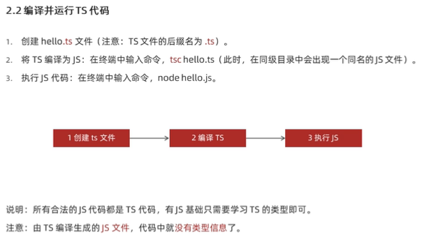
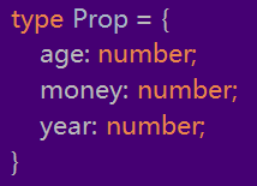

# TypeSctipt学习


## 1 对TS的认识：

**ts=type+js  是js的拓展和超集**

**对js中的变量做了类型声明**

在**编译期就做了类型检查** 减少了类型错误  减少了改bug的事件


## 2 环境搭建

安装：

```
npm i -g typescript
```

查看版本：

```
tsc -v
```


运行逻辑**：在代码运行时候 先有ts工具包将ts语言转化成js ，node.js和browser只能识别js语言。**


## 3 基础使用：

**1 创建.ts 文件 并用ts语言写代码。**


**2 终端输入**

```
 tsc 文件名.ts
```

转化出一个**同名js文件**


**3 运行** 

```
node 文件名.js
```




### 简化：

使用ts-node包  直接在Node.js 中执行。

```
npm i -g ts-node
```

使用：

```
ts-node 文件名.js
```

直接执行

、


## 4  ts常用类型：


ts声明单一类型列表：

```
let numbers:number[]=[3,6,9]

let strings:string[]=['a','b','z']

```

**类似C里面 声明 数组 和 字符串 组**

如果 限制是多个类型呢？

### 联合类型写法 

**用|隔开即可**

```
let strings:(string|number)[]=['a','b','z',3,6,9]
```

|表示联合类型写法 


## 5 类型别名

类似c中的define 宏定义

语法：

```
type 类型的名称=(基础类型1|基础类型2|基础类型3...)
```

例如：

```
type Costumer=(number|string|undefined)[]
let arr:Costumer=['a',23,,2]
console.log(arr)
```


## 6 Function 的类型限制

#### 1 单独给每个参数和返回值都指定参数

普通形式：

```
function add(a:number,b:number):number{
    return a+b
}

console.log(add(3,8))
```

箭头函数形式：

```
const add=(a:number,b:number):number=>{
    return a+b
}
```


#### 2 直接规定好整个函数的类型限制

#### 

```
const add3:(a:number,b:number)=>number  =  (num1,num2)=>{
    return num1+num2
}
```

const add后的  **:(a:number,b:number)=>number 是规定类型限制**

后半部分是就是一个普通的箭头函数


#### 3 无返回值 用 :void 来控制

```
const add3:(a:number,b:number)=>void=(num1,num2)=>{
    console.log(num1-num2)
}
```


#### 4 参数可传可不传入

例如数组中的slice方法 可以slice(1)  也可以slice(1,3)


用  **?:** 去控制  可传可不传的参数

```
const add:(a:number,b?:number)=>number   =   (num1,num2)=>{
   内部函数体...
}
```

**注意：可选参数只能出现在参数列表的最后 即可选参数后面不能再出现必选参数！**


## 7  复杂对象类型的类型限制：

实质上就是在描述对象的结构

语法（以person为例）

```
let person :{
name:string; 
age:number;
gender:boolean;
sayhi():void; 
checkAge(id:number):number
             }
```

**指定对象的对个属性类型时候 用 ; 来间隔**

方法类型的声明也可以用箭头函数：

```
sayhi:()=>void; 
```


可选属性  

和可选参数语法一样 用   ?:   表示

```
let config:{
url:string
method:string
id?: number
}
```

其中的id就是可选属性


## 8 接口  interface

就是给     **复杂数据结构类型规范**   起一个名字 **实现复用**：


```
interface  Costumer {
age : number
name : string 
sayHi() : void
}
```

**每一行只写一个属性类型** 因此 **属性类型后面没有  ;**

#### 接口继承  

**类似java的继承 使用 extends 关键字**

语法：如父类接口：

```

interface  Costumer {
age : number
name : string 
sayHi() : void
}
```

则定义一个女顾客 复杂数据类型：

```
interface  WomanCostumer extends Costumer 
{
isWoman:boolean
}
```


和type 对比：

**type 有 等号  同时tpye 难以实现 继承复用的效果**

```
type   Costumer = {
age : number
name : string 
sayHi() : void
}
```


## 9 元组  

规定了[...] 中包含了多少个元素 以及这些元素相对应的类型

例如：

```
type position =[number,number,string] //使用元组类型规范

let china:position=[101,101,"中华"]
```


## 10 类型推断和类型断言


​    ts中**没有 不被类型限制** 的变量 如果你不写 系统会帮助你补上


#### 类型断言


  **以getElementById 方法为例子  返回的类型是HTMLElement  只有HTML元素公共的属性和方法**

**如果 是 a  就没有herf属性** 

**系统给定的类型太宽泛  因此就要使用类型断言去指定更加具体的类型**

关键字  ：as

```
const aLink = document.getElementByID("...") as HTMLAnchorElement
```

这样就可以访问到a标签特有的属性和方法了


## 11  const 定义的字面量类型

const 定义的 简单数据类型 是不可变的 所以 它 的类型控制 在

系**统自动类型推断的时候会直接以赋上去的值 作为控制类型**

```
const age:18=18

const sayHi =():"hello"=>{
    return "hello"

}
```


#### 使用场景

去配合一组明确的可选值列表使用   

使得函数中的参数的值只能是  列表中的值

```
const changeDirection =(newdir:'north'|'west'|'east'|'south')=>{
    console.log(newdir)
}
```

**使用字面量类型限制了传入的参数 使之更加精确严谨**


## 12  枚举  enum 

 类似于字面量类型＋联合性类型语法糖

表示一组明确的可选值

**语法**：

```
enum Direction {North,West,East,South}
```


**使用：**

```
const changeDirection =(newdir:Direction)=>{
    console.log(newdir)
}

changeDirection(Direction.North)
```

**约定 ：枚举名称和枚举中的值都以大写字母开头**

使用时用 枚举名称.枚举中的值 （类似对象） 	去传参

**实质上赋给变量的还是 这些枚举子元素的哈希值**

```
console.log(newdir)  //如果传入的是Direction.North  打印出的是系统分配的哈希值 0
```


此时就被称为：

#### 数字枚举


当然可以给枚举中的成员 初始化值

```
enum Direction {North=1024,West,East,South}
```

在已经赋值的成员后面的 未赋值的成员 其哈希值系统推断时候每次多1.


#### 字符串枚举

  枚举中的成员的哈希值还可以是一段字符串

```
enum Direction {
North="北方",
West="西方",
East="东方",
South="南方"}
```

注意  字符串枚举没有自增长行为 必须每个都要设立初始值。


## 13 any 类型：

当为 ：any 的时候 可以对该值 赋任何类型的数据  失去了ts保护的又是


 自动出现any 的情况：

```
let a  //只声明 不赋值

funtion add(num1,num2){
...
}   //函数的参数不加类型
```


## 14 typeof 运算符

作用：可以在类型上下文中获取 数据的限制类型

应用：例如：

```
let man:{....许多自定义属性} ={....}
//声明一个有很多属性的 man obj变量

function sayhi(people : typeof man )
//直接用people : typeof man 去限制传入的参数的类型 减少了代码量
```

**typeof  只能查询变量或者属性的类型  但是不发查询函数调用后返回的结果的类型！！**


## 15 TS中的面向对象class编程


和js中的class类很相似  同时也可以作为**ts的一种 类型限制规范存在**


以Person类为例：

```
class Person {
    age: number  //相关属性
    gender: boolean

    constructor(agage: number
        , gender: boolean) {
        this.age=agage
        this.gender=gender
    }  //构造函数

    older(years:number):void{
        this.age+=years

    }  //内置自定义函数
}
```


**调用时实现 js的类型限制：**

```
const lee:Person=new Person(18,true)
```

#### class 类的可见性修饰符：

```
class  Dad{
    public money:number;
    protected  age:number=48;
    protected  wife:string;
    //private wife:string;
    constructor(m:number,a:number,w:string) {
       this.age=a;
       // this.wife=w;
        this.money=m
this.wife=w
    }
}
```

**在这个Dad类中   有public   protected  protected 三种属性修饰符**

和java中的权限很类似。

public：公有 的 可以被任何地方访问 默认可见

protected： 只能在其所在的类和子类（非实例对象中）可见

protected ：私有的  只在当前的类中可以调用 对于实例对象和子类不可见

####  


####  class类的 继承extends

extend子类可以继承父类的public的属性和方法  类java

#### class类的 接口实现implements

class类可以实现interface接口的要求  关键字：implement        类java

```
interface Sayhi{
hi():void
}
```

比如这个Son类继承了Dad类  并实现了Sayhi 的接口

```
class Son extends Dad implements Sayhi
{
    public game:string;
    hi():void{
        console.log("hihihi")
    }
    constructor(m:number,a:number,s:string,g:string) {
        super(m,a,s)
       this.game=g
    }
}

```

**super(m,a,s)**   如果父类有构造函数 那么子类的构造函数要先用super关键字 去调用父类的构造函数 

才能得到this  调用自己的构造函数。


#### readonly 修饰符

表示制度 防止在构造函数之外对属性进行赋值

**readonly关键字只能修饰属性 不能修饰方法**

类似const

**接口interface或者 {}表示的对象类型 也可以用readonly**


## 16 类型兼容

#### 1 class类的兼容问题    和      复杂类型对象的兼容

总的来说 就是 大类型可以兼容小类型（有更多属性的类型可以赋值给 属性较少的对象或者类）

```
class Point {x:number
              y:number}
              
              
class Point3d{
    x:number=3;y:number=2;z:number=1
    sayHi():void{
        console.log('hi,hi,hi,hi')
    }
}

let p:Point = new Point3d()
console.log(p.y)

```

最终这个实例化的p 实质上还是point类 而不是Point3d类

因此不能调用sayHi()方法


**通俗： 拥有的多的人 可以去兼容 拥有的少的人**


#### 2 接口的兼容

和class类一样

**通俗： 拥有的多的人 可以去兼容 拥有的少的人**

并且 **class和interface可以相互兼容**


#### 3 函数之间的兼容

##### 3.1 传参个数的兼容

**通俗： 要求的少的人 可以去兼容 拥有的多的人**

就是参数个数少的函数可以去兼容参数个数多的函数。


##### 3.2 传参参数类型的兼容


##### 3.3 返回值类型：

和class类一样

**通俗： 拥有的多的人 可以去兼容 拥有的少的人**


## 17 交叉类型&

功能类似于接口继承 用于组合多个类型 为一个。

将两个类 或者两个接口 或者一个类和一个接口  合二为一

```
interface a{
    name:string,age:number
}

class b{money:number }


type c=a&b

let obj:c={
    name:'lee',age:18,
    money:123
}

console.log(obj.name)

```

type c=a&b 将接口a和类b  **合二为一 构成一个新的类型限制**

#### 和extends 的异同 

如果extends出现两个同名的变量或者函数 **但是他们的限制不同**  此时会报错

**而** **&     会将两个不同的限制用 | 连接起来**


## 18 泛型

**在保证类型安全的前提下  让函数和多种类型一起工作 实现复用： 常用在 函数 接口 class中**

#### 语法：

```
const GetAndReturn = <Type>(get:Type):Type=>{
    return  get;
}
```

 在函数名称后面 **加<Type>**   表示在这个函数内部出现了一个 **限制变量** 叫做Type

就 可以使用限制变量  去加以限制

```
get:Type
```


#### 使用的方法：

```
console.log(GetAndReturn<string>("hhh"))
```

在函数名称后面 先给  **限制变量** **传参 <string>  再传入实参**

此时调用时 函数内部的  Type  全被替换成了  string   保证类型安全


**简化：**

**在调用函数的时候 可以省略 <> 来简化 这个时候 ts内部 会进行参数类型推断 自动推断出Type 的类型**

但是 如果编译器无法推断类型 或者推断的类型不准确 的时候 就要显式地传入类型参数


#### 泛型约束

在默认情况下  约束变量Type 可以代表任何类型 

**因此 它无法去访问任何特殊类型所拥有的属性和方法**（比如 [ ]  的length，map方法等等）

**因此可以进行泛型约束 说明 约束变量Type是哪几类特殊类型 就可以调用它们所拥有方法**


##### 方法1：指定更加具体的类

例如用  value：Type[] 去 限制 约束变量Type是 一个数组  

就可以调用数组所拥有的方法和属性

```
const GetAndReturn = <Type>(get:Type[]):number=>{
    return get.length;
}

console.log(GetAndReturn<number>([3,5,7,9,11]))
```

用的比较少


##### 方法2：添加接口 实现约束

语法：

```
interface HaveLength{length:number}

```

添加HaveLength 的interface接口 在里面定义 数组的内置属性length

```
const GetArrAndReturn = <Type extends HaveLength > (get:Type):Type=>{
    console.log( get.length)
     return get
}
```

<Type extends HaveLength >   规范 Type 要满足接口要求  即只能输入 [ ] 形参数。


注意：传入的实参只要有length 属性即可 这也符合前面讲到的接口的兼容性

**通俗： 拥有的多的人 可以去兼容 拥有的少的人**


#### 接口interface  的泛型使用：

**语法 在声明接口 的名称后面加上  <Type>**

接口的类型变量  可以被接口中的所有成员都使用

```
interface HaveLength<Type>{length:Type}
```

使用：

**要显式指定出 Type 到底是哪个类。**

```
const GetArrAndReturn = <Type extends HaveLength<number> > (get:Type):Type=>{
    console.log( get.length)

     return get
}
```

<Type extends HaveLength<number> >  显式指定


**泛型接口的理解： 实质上js 的 [ ] 组就是一个泛型接口**

当数组中元素是string 时  编译器自动将 Type设置为 string

当数组中元素是number 时  编译器自动将 Type设置为 number

**技巧： Ctrl 加鼠标左键 可以查看变量和函数的具体信息**


#### 类Class  的泛型使用：

**类似于泛型接口 在声明类 的名称后面加上  <Type>**

**语法** ：创建泛型类：

```
class Person <Type>
{
   age:Type
    money:Type
    //构造函数constructor
    constructor(age:Type,money:Type) {
       this.age=age
       this.money=money
    }
}

```

 

创建实例对象：

```
const man= new Person<number>(18,101)
```

或者：

```
const man= new Person(18,101)
```

**当有构造函数的时候 如果传入的参数中也是  Type 变量规范**

  **那么系统会根据传入的参数值 自动传入Type的实际值**

 在Typescript 2.7 release版本出来后，设置了一个新的编译器选项strictPropertyInitialization。

 当本选项 strictPropertyInitialization:true 的时候，编译器会确保一个类中所有的属性都已经初始化，

如果没有，那么在属性构建的过程中就会抛出错误。

**因此一般声明class类 最好写上 构造函数**


## 19 四种常用的泛型类：

这四种泛型类 相当于 **语法糖 减轻了代码量**

### 1 Record <Keys,Type>

构造了一个 类的规范 这个类中必须要有 

**所有Keys中声明的属性名字**   **第二个参数Type 表示这些属性 都是什么类型的**

例如：

```
type  numArr =Record<'a'|'b'|'c', number[]>
```


实质上就是：

```
type  numArr =
{
    'a':number[]
    'c':number[]
    'b':number[]
}
```


### 2  Readonly <Type'>

构造一个新的 类规范 这个 类 规范  **复制**了原来的Type规范 

**并且将原来的规范中的所有属性 都设置成了readonly**


### 3  Partical<'Type>


构造一个新的 类规范 这个 新的类规范  **复制**了原来的Type规范 

**并且将原来的规范中的所有属性 都设置成了 **可选项


等同于

```
type PartialPros ={
    id ?:string
    children ?: number[]
}
```


### 4    Pick<'Type,Keys>

**从Type中选择一组 属性来构建一个新的 类型规范**


## 20 索引签名类型：

适用场景：

**无法确定对象中有哪些属性（对象中可以出现任意多的属性）**

语法：

```
interface  AnyObj
{
    [id:string]:number
}

let obj:AnyObj={
    age:19,
    year:2004,
    money:101
}

```

**因为js中对象的属性键名称都是string型**

**因此 [id:string] 就可以容纳所有string类型的属性键名称**


## 21   映射类型

#### 1 简单类型 映射到对象

```
type propKeys = 'age'|'money'|'year'

type Prop ={ [key in propKeys]:number}

```

得到结果：




**[key in propKeys]  就是 用 | 连接起来的一个个 string 数据规范。**


#### 2 复杂对象 映射到对象


**语法：[key in keyof 复杂对象]  ：类型限制**

```
type Props={
    name:string
    age:number
    isMale:boolean
}
type  booleanOfProps ={
    [key in keyof Props]:boolean
}
```


#### 3  索引查询语法


## 21 .d.ts 类型声明文件

类型声明文件：**用来为 已经存在的 js库提供类型信息**

**这样在ts中  使用这些库的时候 就像和 TS一样 都会有代码提示 和类型保护机制**


.ts 文件 ：既可以包含类型信息 又可以含有可执行代码 最终被编译为 .js文件。

.d.ts 文件 ： 只包含类型信息的类型声明文件  不会生成 .js 没有可执行代码。


#### 使用第三方类型声明文件

**1  库自带类型声明文件  会自动加载 直接用就好**


**2 找 DefinitelyTyped 这个github仓库  下载该仓库提供的 ts类型声明包** 

**包的名称格式： @types/***


#### 自己自定义类型声明文件

模块化； 创建 index.d.js 文件

**在文件中 type  定义类型并 export导出**

```
type People ={
    name:string
    age:number
    GenshenLevel:number
}
export {People}
```


**在其他.ts文件中 import 导入并使用：**

```
import {People} from "./index";
let man:People 
```


#### 为已有的   .js文件  提供类型声明：

**使用declear 关键字**

**type interface 等明确是 ts类型的 可以省略关键字**

**而其他在js 和ts中都能使用的 要用declear 去明确 此处应该用于类型的声明。**


```
type People ={
    name:string
    age:number
    GenshenLevel:number
}

declare let count:number
```

type 不用加  declare  

let     需要加  declare 