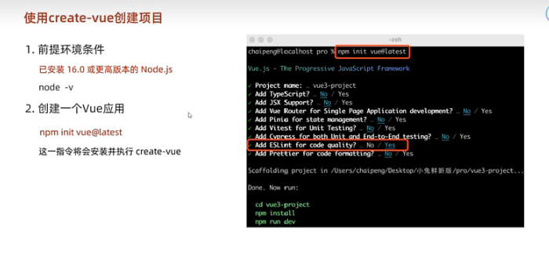
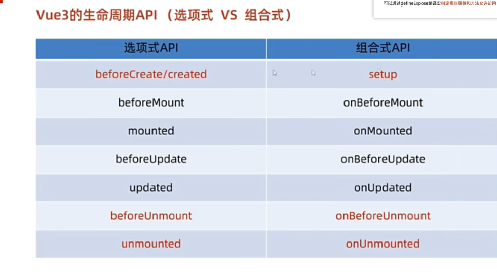
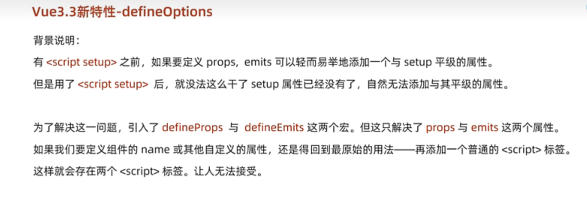
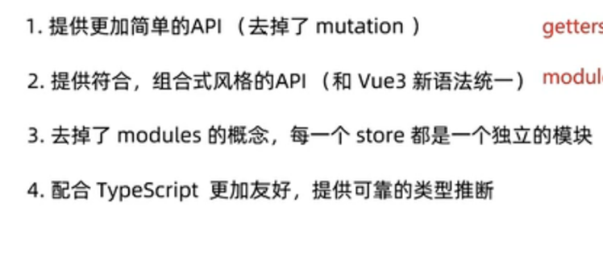

#        Vue3学习


## 1           项目创建




v2 v3项目差异

1   config 变成了 基于vite的配置

2   package.json 核心依赖项变成了V3

3   main.js   不再是new VUE 而是 createAPP 函数去创建应用实例

4   app.vue   和各个组件中的templete  

​         **不再要求是唯一的根元素**

5  index.html 中提供app的挂载点


##        2 setup 选项


**1 添加选项后** 

**在 beforeCreate 钩子函数之前自动执行**   


**2 其代码特点： 定义数据+函数  然后以对象的方式return**


**3 语法糖：**

```
<script setup>


</script>
```

分装后更简单地调用组合式API


**4 setup中的this指向undefined**


​    **不能再使用this！！！！**


## **3  ref() API**

作用：接受一个简单或者复杂数据类型的数据 

并返回一个响应式的对象。

**对标V2中的state**


使用方法：

```
<script setup>
import {ref} from 'vue'  //导入ref函数

const people=ref({
age:19,
name:"leeb"
}) 

</script>
```

这样就创建了一个people的响应式数据对象


语法更类似 js  而不是 v2


## 4  computed 计算属性函数

思想和v2一致 

写法：

```
<script setup>
import {ref} from 'vue'
import {computed} from 'vue'  // 导入computed


const people=ref({
age:19,
name:"leeb"
}) 

const agein10year = computed(()=>{
return people.age+10
})
// 返回的是基于响应式ref的数据 进行逻辑计算的值
</script>
```

同样**也是响应式的**

计算属性中 **1 不应该有异步请求或者修改dom**

​                    **2  计算属性应该是readonly  特殊情况 配置get set**


## 5  watch监视器

类似于v2 的watch


使用方法：

```
<script setup>
import {ref} from 'vue'
import {watch} from 'vue'  // 导入watch

const count=ref(101)

const people=ref({
age:19,
name:"leeb"
}) 

watch (count,(new,old)=>{
处理逻辑...
})

// watch 第一个参数是要侦听的响应式数据 第二个是参数为old和new的回调函数。


watch ([count,people],([newCount,newPeople],[oldCount,oldPeople])=>{
处理逻辑...
})


//可以用  []  来一次监听多个数组 但同样 回调函数的参数也是数组list


watch (people,(new,old)=>{
处理逻辑...
}，{deep:rtue})

//  实现复杂数据类型的深度监听


watch (()=>people.name,(new,old)=>{
处理逻辑...
})
// 对复杂数据对象的内部单个属性  进行监听。


</script>
```


## 6 关闭Eslint

找到与src的vue.config.js文件，

然后把下面的代码复制进去，然后重新运行eslint就关闭了

```
module.exports = {
  lintOnSave: false
}
```


## 7 V3 的生命周期函数

选项式API  类似v2

而组合式API  则是V3新的选项





**从服务器请求数据时 因为setup 写在了script 后** 

**因此可以直接写**


**对于dom元素的操作 在onMounted 函数中创建** 


## 8  V3中 的  父子组件的数据传递


#### 父传子：

父亲在实例化子组件的时候传入的自定义属性

```
<div class="dad">
  这是父组件
  <SonCom msg="hellowrold">

  </SonCom>
</div>
```


在子组件中接收：


```
<script setup>
const props = defineProps(
  {
    msg: String
  }//声明接受到的Props

)
</script>
```

defineProps 声明宏定义


script 中使用：

```
console.log(props.msg)
```


teplete中使用

```
{{msg}}
```


#### 子传父：

（使用emit宏定义）

```
const emit= defineEmits['changeDad']
```

声明函数 内部使用emit方法

```
const fn=()=>{
emit('changeDad',要传入的值)
}
```


在父组件中进行监听

```
 <SonCom @changeDad="Dadfn">

  </SonCom>
```


并在父组件的函数Dadfn中进行值的修改

```
const Dadfn = (newvalue) => {
值修改的相关操作...
}
```


## 9 ref 获取组件实例或者dom元素

使用方法：

先在script中 声明ref类变量

```
<script setup>
import {ref} from 'vue'  //先导入ref

const r1= ref(null)

const r2= ref(null)
// 先声明为空

</script>
```


在组件或者元素中进行绑定

```
<templete>
<div ref='r1'> 我是dom标签 </div>

<SonCom  ref='r2'>
</SonCom>

</templete>
```


注意在ref绑定后操作dom元素

**一定要在   onMounted 函数中进行 此时完成了对dom元素的挂载** 

**才可以实现 对dom元素的操作**


当使用 ref.value 去操作组件的时候

要注意 **此时访问 该组件的内部属性和方法 无法访问！！**

setup语法糖 中组件的内部属性和方法 默认是不开放给父组件的

**因此要通过宏定义去指定 允许访问的属性和方法.**


### defineExpose

该宏定义内部是一个list组 里面放着各个允许访问的属性和方法

```
<script setup>
defineExpose([ 允许访问的属性和方法.])
</script>
```


## 10 跨多代传值   provide inject

**在祖先组件中**

```
<script setup>
import  {provide} from 'vue'
provide("要传递数据的名称",value)
</script>
```

**在后代组件中**

```
<script setup>
import { inject } from 'vue'

const age = inject('要传递数据的名称')
</script>
```

传递的数据可以是 响应式ref  也可以是普通数据


### 后代组件修改祖先组件的值

可以让祖先组件provide一个函数给后代 后代调用该函数去修改祖先组件的值

```
provide("changezuxian".(newvalue)=>{
祖先ref元素.value=newvalue
})
```

在后代元素 中 inject 该方法并调用即可，


## 11 defineOptions 宏定义




**defineOptions 就是为了设定和setup同级 的自定义属性**

**避免引入两个 script**

语法:

```
<script setup>

defineOptions({
name:"abc",
isFemale:false
})


</script>
```

宏定义的内部还是 对  象


## 12 V3中    v-model和 defineModel

 v3 中的  v-model 语法糖

相当于传递了一个modelValue 属性 同时触发 update：modelValue 事件

在子组件中想传递回父组件会 很麻烦/

具体模版如下：

```
<script setup>

defineProps({
modelValue:String

})
const emit= defineEmits['update：modelValue']
<script>


```


在template中

```
<input type='text'
:value='modelValue'
@input=“e=>emit('update：modelValue',e.target.value)”>
```

因此用  defineModel简化代码

子组件中：

```
<script setup>
import {defineModel} form vue
const modelValue = defineModel()
<input type='text'
:value='modelValue'
<script>
```


在template中省去了emit

```
@input=“e=>modelValue=e.target.value”>

```


使用是要在 vite.config.js 中更改设置：

```
plugins:
{
script:{
defineModel:true
}
}
```


## 13  pinia实现数据的共享

​    **pinia相较于vuex的优点**：



安装:

```
npm install pinia
```


创建一个 pinia 实例 **(根 store)** 并将其传递给app应用：

语法：在main.js中：

```
import { createApp } from 'vue'   //导入包
import {createPinia} from "pinia";  // 导入包
import App from './App.vue'   // 导入包


const pinia=createPinia()  //生成 根部store
createApp(App).use(pinia).mount('#app') //使用use()
```


### 创建store库：

先在和scr同一级别建立 store 文件夹 在文件夹中

**创建各个js文件  内部存放store**


两种创建方式

### 选项式API（类似V2）

```
import {defineStore} from "pinia";
//导入包的defineStore方法

//第一个参数是你的应用中 Store 的唯一 ID。
//你可以对 `defineStore()` 的返回值进行任意命名，但最好使用 store 的名字，同时以 `use` 开头且以 `Store` 结尾。(比如 `useUserStore`，`useCartStore`，`useProductStore`)


export const useCountStore = defineStore('Count', {
    state: () => ({count: 0}),
    getters: {
        double: (state) => state.count * 2,
    },
    actions: {
        increment() {
            this.count++
        },
    },

})
```

注意  v3中只有state actions 和getters 三个选项式API


### 组合式API

**类似在setup中的写法**：

例如：

```
export const useCounterStore = defineStore('counter', () => {
  const count = ref(0)
  function increment() {
    count.value++
  }

  return { count, increment }//选择你要暴露共享的属性和方法
})
```

- `ref()` 就是 `state` 属性
- `computed()` 就是 `getters`
- `function()` 就是 `actions`


### 使用state 的数据

虽然我们前面定义了一个 store，但在我们使用 `<script setup>` 调用 `useStore()`(或者使用 `setup()` 函数，**像所有的组件那样**) 之前，store 实例是不会被创建的


如果直接写：

```
const store = useCounterStore()


const { name, doubleCount } = store 
name // 将始终是 "Eduardo" 
doubleCount // 将始终是 0 
```

**直接结构 会让数据失去响应式的特性**


正确方法：使用storetorefs()函数

```
<script setup>
import { storeToRefs } from 'pinia'
const store = useCounterStore()


const { name } = storeToRefs(store)
// 并且会跳过所有的 action 或非响应式 (不是 ref 或 reactive) 的属性


const { increment } = store
// 作为 action 的 increment 可以直接解构
</script>
```

ref响应式数据要用 storeToRefs

而作为action 的函数可以直接解构。


### **其他使用方法：**

```
const store = useCounterStore()
//store 就是useCounterStore() 的别名


console.log(store.name)

console.log(store.increase)
```

**每次调用数据 就相当于使用了一次useCounterStore()函数**

**依旧有响应性**


## 14 pinia 持久化工具

安装 ：

```
 npm i pinia-plugin-persistedstate
```


将插件添加到pinia 的实例上：

对pinia的实例化对象使用 use()

### **main.js总使用：**

```
import { createApp } from 'vue'
import {createPinia} from "pinia";  
import App from './App.vue'  
import {piniaPluginPersistedstate} from 'pinia-plugin-persistedstate'  //导入持久化包

const pinia=createPinia()
pinia.use(piniaPluginPersistedstate)
createApp(App).use(pinia).mount('#app')
```


### 对store 的持久化的语法：

``` from '
import {defineStore} from 'pinia'

export const useMsgStore=defineStore(
"msg",
()=> {
.... 相关的内置数据
}，
{
persist:true,
}
)
```

原本的defineStore只有两个参数 现在**新增了第三个参数**

{

persist:true,

}


### **持久化的作用和实质：**

实际上就是在**localStorage** 中进行存储

**store.$id 作为storage的默认的key**

自动实现  JOSN.stringfy  /  JOSN.parse

**整个state都被进行了持久化**(所有state的数据)


如果只想持久化state的其中几个数据

defineStore的第三个参数

{

persist: {

path:['state数据1'，'state数据2'.....]

}

}

对象中声明一个path 的list 里面写要去持久化state的哪些数据