**{vue： 创建用户界面的渐进式框架**


## 1 vue 包的引入

```
<script src="https://cdn.jsdelivr.net/npm/vue@2.7.14/dist/vue.js">
</script>
```

引入的是开发者版本  有注释和警告


## 2  vue实例的使用

**核心步骤：**

**1 准备容器**

**2 引入配置包**

**3 创建VUE实例**

**4 指定配置项  实现数据渲染**

el制定挂载点 data提供数据


html文件：

```
<div id="one">
  {{msg}}
</div>
```

js文件：

```
const app=new Vue({
    el:'#one',
    data:{
        msg:'one piece'
    }
})
```


## 3 插值表达式

vue模版语法:

```
<div> {{ age }}  </div> 
//data内属性值

<div> {{ age.floor() }}  </div>
//data内声明的函数

<div> {{ age>18? '成年';'未成年' }}  </div>
//  三元表达式
```

注意点：

1 使用的数据，函数必须在data中存在

2 {{}} 内是表达式 不是语句 不能出现  if  for等

3 标签内部的属性中不能出现 {{}} 插值。


## 4 vue核心特性： 响应式

**数据改变 vue会监听到数据的修改 自动进行dom操作更新视图**


数据修改

```
实例.属性名.=value
```


## 5 vue指令


指令：   **带有v-前缀的特殊的标签 的属性**

```
<div v-html='str'> </div>
```


#### **1 v-html**

```
<div v-html='str'> </div>
```

解决了{{}}无法解析标签的问题

可以在data中动态设置元素 innerHTML


#### 2、3    v-show和v-if

v-show:

```
<div  v-show="表达式"> </div>
```

其中表达式  是由在vue中的data决定的

v-show 采用设置css的display元素来控制隐藏  

常常用于  要多次显示隐藏的场景 （tab栏）


v-if:

```
<div  v-if="表达式"> </div>
```

其中表达式  是由在vue中的data决定的

v-show 直接dom操作 删除或者创建 来控制隐藏

常常用于只用一次显示隐藏的场景 （广告）


#### 4、 5  v-else   v-else-if

配合v-if 使用

和if  elseif使用一致


#### 6         v-on： 和 @ 简写

相当于绑定事件监听器

语法：

```
<button @click="fm()">切换隐藏</button>
```

或者

```
<button v-on:click="fm()">切换隐藏</button>
```


后面可以跟表达式或者该vue对象中内置的methods中的函数

**1、methods属性中声明函数 不用加function关键字**

**2、在methods 中调用 该vue对象的属性 还是用 this.属性名**

例子：

html中

```
<div id="one">
  <button @click="fm()">切换隐藏</button>
 <div class="two" v-show="!flag">one piece!!</div>
</div>
```

js中：

```
const app=new Vue({
    el:'#one',
    data:{
        msg:'one piece',
        flag:false
    },
    methods:
        {
            fm(){
                this.flag=!this.flag
            }
        }
})
```


#### 7  v-bind：和  ：简写

在 标签中难以解析   {{  }}

在前面添上  v-bind：即可设置html中src url title等属性

语法：

```

```

简写：

```

```


**其中imgURL和msg都是vue对象里面的 data**


#### 8  v-for 

用于数据的循环 多次渲染整个元素

**遍历数组时 语法：** 

```
  <li v-for="item in list">
```

类似  foreach  用法 

不用索引 只用一个参数item


```
  <li v-for="(item,index) in fruit">
```

用索引 两个参数   item 和 index


例子：

html：

```
<div id="on">
    <table>
        <li v-for="item in fruit">
            {{item.name}}

        </li>

    </table>

</div>
```

js：

```
const shuiguo = new Vue({
    el: '#on',
    data: {

        fruit:[{id:1,name:'苹果'},{id:2,name:'栗子'},{id:3,name:'火龙果'},{id:4,name:'桃子'}]

    }
})
```


#### v-for中的key

当不使用key时候  在对list增删改查的时候  vue会保留前几项的css样式 

导致增删改查结果不准去

因此要使用

**key属性=‘’唯一标识‘’**

**便于vue进行列表项的正确排序复用**

```
 <li v-for="item in list" :key='item.id'>
```

注意事项：

**key值只能是数字或者字符串**

**key必须具有唯一性**

**推荐用  id（唯一性）  不推荐用 index（会随着变化，不对应）**


#### 9 v-model

#### 

给表单元素 实现双向的数据绑定

数据变化 视图会自然更新  视图变化 数据也会自动更新

语法：

```
v-model=‘变量’
```

变量是vue对象中的data中的数据变量


## 6 指令修饰符

vue指令.后缀 不同的后缀封装了不同的处理操作 起到了简化代码的作用

常用修饰符：

```
1 按键修饰符
@keyup.enter   //键盘只监听回车键


2 v-model修饰符
v-model.trim  去除收尾空格
v-model.number 转数字（当里面不是数字的时候不进行转换）


3 事件修饰符
@click.stop  //阻止冒泡
@click.prevent   //阻止默认行为
```


## 7  v-bind 通过控制class和style  更改css样式

### 7.1 控制class 

语法：

```
<div :class={类名1：布尔值1（或者结果是布尔值的式），类名2：布尔值2}></div>
```

该语法不影响 以class="" 设置的class属性。


或者：

```
<div :class=[类名1，类名2，类名3]></div>
```

本质上是一个class列表。


**应用：tab栏active切换**

js数据：

```
const tap = new Vue({
    el: '#box',
    data: {
        activeindex: 0,
        list: [{id: 1, name: '今日推荐'}, {id: 2, name: '每日特价'}, {id: 3, name: '品类秒杀'}]
    }
})
```


html应用：

```
<div id="box">

    <div class="sbox" @click="activeindex=index" :class="{ active: index===activeindex }" v-for="(item,index) in list"
         :key="item.id">
        <a href="#">{{item.name}}</a>

    </div>
</div>
```


使用v-for循环遍历 使用@click绑定事件  用：class="{...}"  更改active状态


### 7.2 控制style

语法：


```
<div :style={"css属性1"："属性值"，"属性2"："属性值"}></div>
```


## 8    v-model应用于表单其他元素

vue会自动适应data中的值的类型

但是一般来说：

都会在表单中各个选项中设置value元素

实质上最后在vue里还是 string类型（或者int？）


## 9 计算属性

概念 :基于现有的数据所计算出来的新属性  


语法：

**1 在声明computed 配置项中 一个计算属性对应一个函数**

**2 使用的时候  和普通属性也一样使用  {{}}**

```
const tap = new Vue({
data:{...},
computed:
   {
      计算属性名()
      {
      数据处理相关代码
      ruturn 结果
      }
   }
   
   
   
})
```

计算属性函数内部 可以直接通过 this  进行访问 


优势 

computed计算属性会对计算的结果缓存 其实质上就是一个属性

只有当依赖项变化的时候才会重新自动计算


**可以  计算一次，html网页上使用n次**


**而如果用methods 使用n次 就要调用  n次函数** 


### 计算属性的后台直接赋值

其默认的简写 只能读取 不能直接赋值更改

如果要去修改  需要完整写法：

语法：

```
computed：
 { 计算属性名：{
     get(){
       数据处理相关代码
      ruturn 结果
     },
     set(value)
     {
       data.属性1=value.slice(...)
        data.属性2=value.slice(...)
     }
 }}
```


**1    get中 代码实质就是简写的代码**

**2    set执行逻辑 是 当vue检测到 计算属性直接赋值  后   将直接赋的值  作为参数  调用给value形参**

**再执行set 函数  处理传入的值 更改data中的数据   因为依赖项被改变 计算属性也自动改变更新**

**从而实现计算属性的后台直接赋值。**


## 10 异步函数async和await的用法

**async 是异步的意思，await则可以理解为 async wait。**

**所以可以理解async就是用来声明一个异步方法，而 await是用来等待异步方法执行**


 async作为一个关键字放在函数前面，表示该函数是一个异步函数，

异步函数意味着该函数的执行不会阻塞后面代码的执行；而 await 用于等待一个异步方法执行完成；


当函数内部执行到一个 await 语句的时候，

如果语句返回一个 promise 对象，

那么函数将会等待 promise 对象的状态变为 resolve 后再继续往下执行。

并会阻塞该函数内后面的代码。


## 11 watch监视器

**作用：**

监视data中数据的变化 执行一些业务逻辑或者异步操作


### 简单写法：简单数据类型的监视

```
const app=new Vue({
  data:{
  age:18,
  name:         {
                first_name:lee,
                last_name:boo
                }
       },
      
  watch:{
 "age"(newvalue,oldvalue)
              {
              执行函数体...
              }
  "name.first_name"(newvalue)
             {
              执行函数体...
              }
              
  }
  

})
```

**1 注意监视器的名字要和属性的名字相同 并且要加引号**

**2  有两个参数newvalue和oldvalue  也可以只用第一个**

**3 一般用于监听  复杂数据类型中单个数据  或者简单数据类型**。


### 全写法：复杂数据类型的监视

添加配置项：

```
watch：
{
  复杂数据类型名字:{
  deep:true，
  immediate:true //初始化的时候就执行一次handler方法
  hander(newValue,oldValue)
     {
       要执行的代码段...
     }
  }
}
```

当复杂数据类型中 有任何一个子元素的值发生改变时  就会执行handler函数


## 12 VUE的生命周期和八个钩子函数

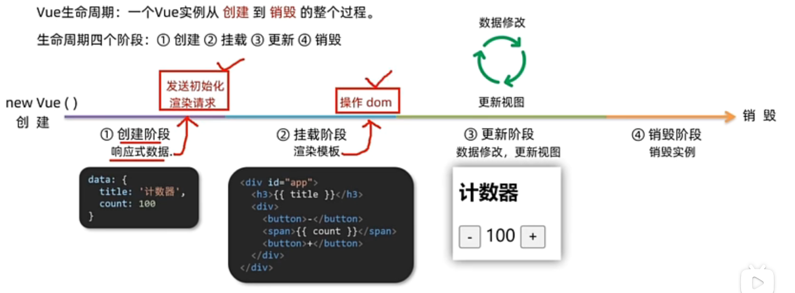


一个vue有四个阶段

**在网页加载完毕后 实际上已经完成了创建阶段和挂载阶段**


**在这四个阶段前后 可以在vue中创建八个不同点位的钩子函数**


**以便控制vue在不同阶段 进行自定义操作**  

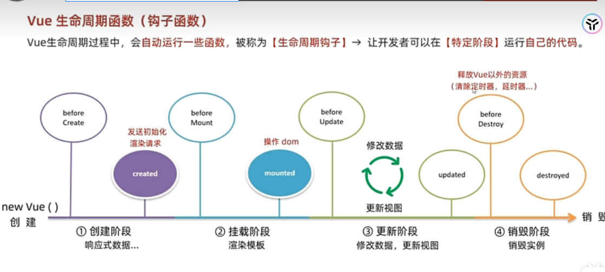


常用：  1  **created** 函数中**发送初始化渲染请求 并将数据赋值vue中的data**

​              2  **mounted** 函数 一般在初始化之后 **再次自定义 去操作dom树** 

​              3  **beforeDestoryed  函数**   在内部去释放除了Vue之外的资源 比如定时器 延时器之类的


例如： **created** 函数中 发送初始化渲染请求


```
const app=new Vue({

el:"#app",

data:  {
       list:[]
        },
        
async created(){
                const res= await axios.get("url")
                this.list=res.data.data
               }        

})

```


## 13  VUE 工程化项目开发规范


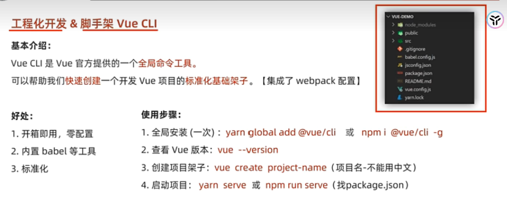


####                                              工程化项目包 内部结构：


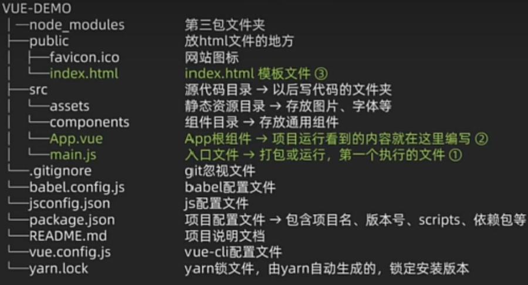


####                                                  项目运行流程

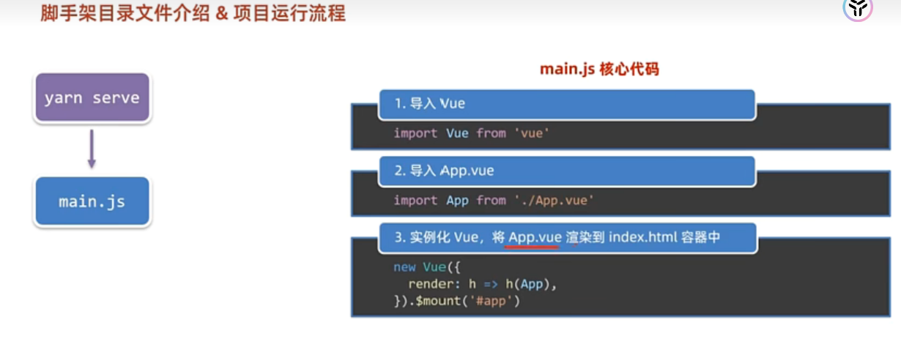


## 14     组件化 和.vue 内部结构


**组件化  可以提升开发效率  便于维护 和复用**


组件分为根组件 和  普通组件


 **根组件：应用最上层的组件 包裹所有的小组件**


#### .vue 文件的组成部分：

```
<template>
    填写html组件  
    有且仅有一个根元素
  
</template>

<script>
    填写内部的js逻辑 类vue对象  
  
</script>

<style>
         css样式   
</style>
```


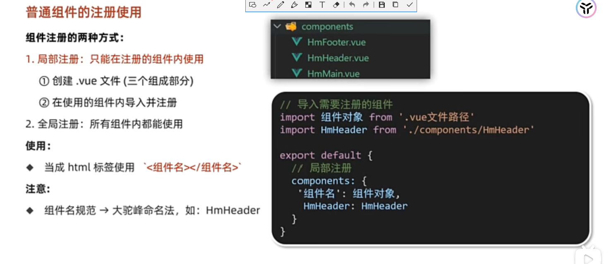


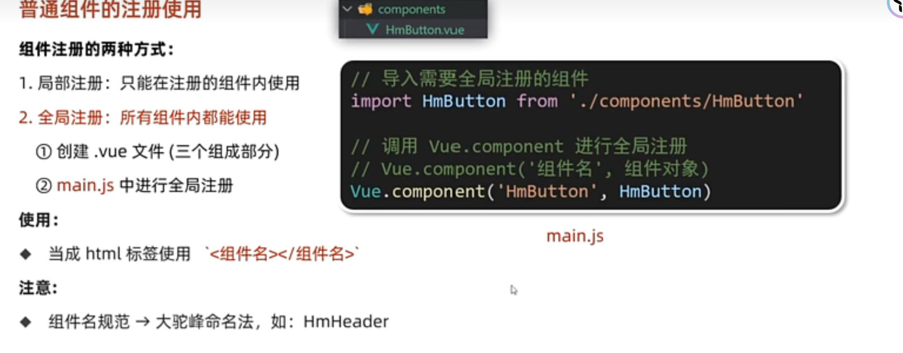


## 15  局部样式设置 scoped


在不同的组件中 都用<style>去设置css样式  

**该样式会  全局生效    导致多组件之间样式冲突**

因此要将组件中的  css样式 加上scoped属性 变为局部样式 只影响当前组件


语法：


```
<style scoped>
   css设置相关代码
</style>
```


原理 **实质上组件内标签都被 添加了 data-v-hash  这个属性** 

**css选择器也添加了对应的[ data-v-hash ]属性选择器**

最终实现了 css设置的局部化


## 16    组件中的数据 data 的设置规范

语法：

```
export default{
    data(){
    return{
              //data内的数据对象
          }
    }

}
```

**其用法和原来data项的用法相同。**

这样**可以保证 组件每实例化一次 都会生成一份独立的数据对象 实现数据独立**


## 17    组件通信 -父子组件通信


### 17.1 父组件props传递给子组件


使用 v :bind 在生成 子组件实例的时候 

   给子组件加上自定义属性


```
<Son :sondata="daddata">
```

**将父组件data中的datadata赋给子组件的sondata属性**

在子组件 的export default中 

设置props 用数组去承接这些自定义属性 

即可 在子组件中获得  父组件传过来的数据

```
<script >
export  default {
  props:['sondata']
}
</script>

```

**当父组件的数据更新时候 子组件中接收到的数据也会随之而更新**


### 17.2 子组件传递给父组件  $emit

**实质是给 父组件 自定义一个 来自子组件的event  并监听该事件**

**子组件可以通过执行自己的函数**

**触发该event  并向父组件发送 数据作为 父组件中响应函数的实参**

```
<Son @sonEvent=“fn”>
```

**fn即为父组件要执行的函数**

该fn函数应该 声明形参 来承接 子组件传过来的数据


在子组件中声明函数

```
methods：
{
   sonfn{
   this.$emit("sonEvent",this.sondata)
   }
}
```

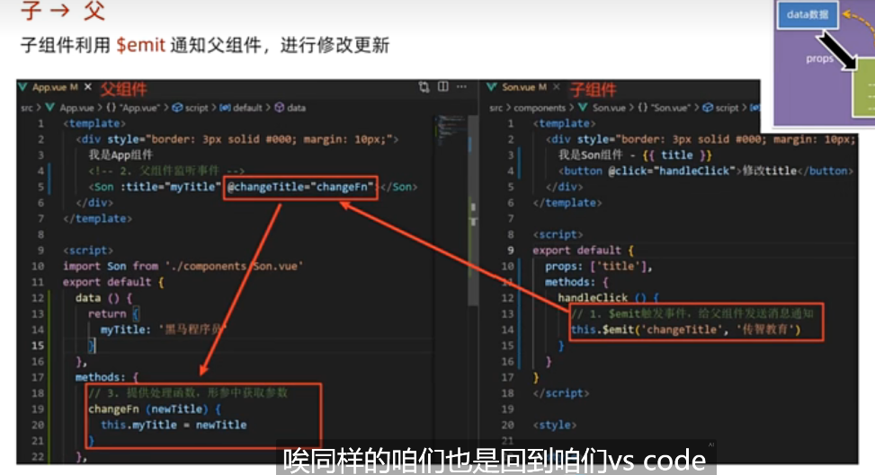


## 18  组件通信 -隔代或隔多代组件通信

**实现直接跨层级 不用逐层逐层地去使用父子通信**

使用   **provide**  和    **inject**

祖先组件provide提供数据

```
export  default{
 provide(){
          return  
          {
          color:this.color,
          // 可以是简单数据类型
          userINFO:this.userINFO
          // 也可以是复杂数据类型
          }
         }
}
```


在后代组件中使用  inject 取值使用

 

```
export  default
{
inject['color','userINFO']
}
```

这样后代组件就可以接受到 祖 先组件的数据

**注意：**

使用provide  inject时候

**传递复杂数据类型是响应式的**  

**传递简单数据类型非响应**

因此  一般将数据包装成 复杂数据类型。


## **19 非父子通信**

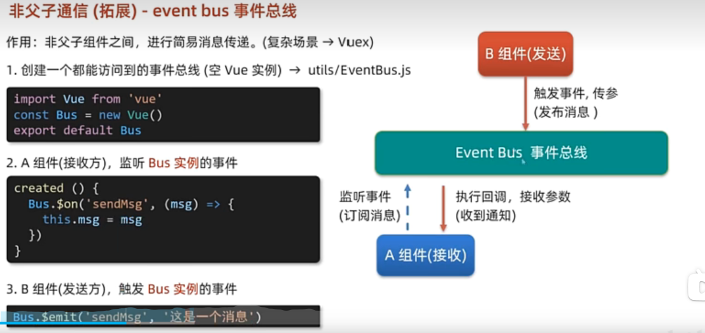

用于简易 的消息传递


## 20 props的属性和自定义处理

props实际上就是组件上注册的一些自定义的属性  

利用v-model： 想里面传值

```
<DIY组件  :属性1=value1 :属性2=value2>

</DIY组件>
```


则在DIY组件中

```
export default{
props;['属性1','属性2']

}
```

这样在 DIY组件中 

**就可以通过属性来调用自定义属性传入的value值**


可以传入任意类型的prop s **复杂数据类型也可以**


### props效验

语法（改写成  对象格式）

```
props:
{
  属性1：属性类型（布尔、数字、str型等等）
}
```

更加精细化处理（对象嵌套对象的格式）

```
props:
{
  属性1:{
  type:   number，  //属性类型（布尔、数字、str型等等）
  required:  布尔值，//是否必须传入
  default    value，//设置默认值
   DIYfn（传入的value）
           { 函数体
             return 布尔值
            }
  //自定义逻辑校验            
  }
}
```


**props 中的数据是外部的  在模块中无法直接更改**

**同时 数据源的数据发生更新的时候  props中的值也会自动更新。**


## 21 V-model

提供数据的双向绑定 

实质上是value属性和input 的双向合写

```
$event 是用于模版中 获取事件的形参
```

当组件化表单其他属性想实先双向绑定时  可以按照类似思路

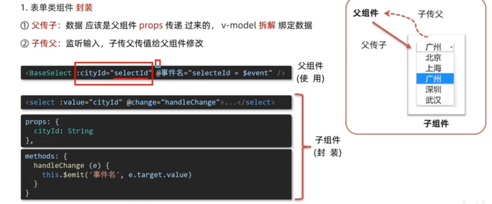


​        **因此 当表单类组件封装 时候 如果是输入型的数据  可以直接用v-model**


## 22  .sync 修饰符


作用： 实现子组件和父组件 的**数据的双向绑定**

**同时props中的属性名 可以自定义**

本质是 v-bind  和   @updata：属性名  的合写


语法：

在父组件中使用时候

```
<Son :diydate.sync="daddata">
  

</Son>
```


子组件中：

```
export default
{
 props:{
        diydata：数据类型
       },
 
methods:
{
     change(){
     this.$emit('updata:idydata',要更改的值)
     }
}
       
}
```

还是用props去承接传递数据   修改时候用   this.$emit   ('**updata:自定义的数据**'  ,  要更改的值)


## 23       ref和$fefs

利用ref 和  $refs  可以用于获取dom元素 或者组件实例


**特点：查找范围在当前组件  而不是整个dom**


document.querrySelector.("") 查找范围过大  容易查找错误


### 获取dom元素

语法：

```
<div ref="自定义名称">

</div>
```

在 mounted  以后 在通过 this.$fefs.自定义名称  去选取该dom元素

```
mounted()
{
console.iog(this.$fefs.自定义名称 )
}
```


### 获取 组件实例

语法：

```
<Son  ref='自定义名称'>

</Son>
```


调用组件对象里面的方法

```
this.$refs.自定义名称.组件的方法()
```


  

## 24    $nextTick的使用

**等待dom更新后  才会去触发执行该方法里面的函数体**

语法：


```
this.$nextTick(()=>{
this.$refs.自定义名称.内置方法()
})
```


原因：vue是异步的  是等待所有语句都执行后 才去更改dom树  

**因此  如果有些语句要在dom树更改后执行**

**就需要  使用$nextTick 去修饰内部的执行语句**


## 25 自定义指令：

可以封装一些dom操作  实现代码复用


### 全局注册：

```
Vue.directive('自定义指令名'，{
“inserted”(ele)
    { 
      对dom元素ele的一些相关操作
    }
})
```

形参  ele  指的是 插入该自定义指令的dom元素

“inserted” 是钩子函数 指的是该dom元素被添加后这个时间点 执行该函数


### 局部注册

```
export default
{
   directives:
   {
      指令名称：
        {
          inserted (ele,bending)
              {
              //对ele标签的 一些dom操作
              },
         update (ele ,bending)
              {
              //dom操作
              }
              
        }
   }
}
```

**形参  ele  指的是 插入该自定义指令的dom元素**   

**形参bending 是使用 v-自定义指令='value' 中传入的value**

update  在传入的value 发生变化时候执行的函数


### 使用方法：

```
<div  v-自定义指令名称=‘value’>

</div>
```


## 26  自定义插槽


**效果 ：让组件内部的一些结构 在实例化的时候 可以实现自定义内容**


### 基础语法：

**定义组件的时候**  比如定义一个叫 Son 的组件

```
<template>
   <slot></slot>
</template>
```

使用  <slot></slot> 去 当做占位


**实例化 组件的时候**

```
<Son>  要传入的文本或者HTML结构的文本  </Son>
```


### 默认传值

定义组件的时候  使用  <slot></slot> 占位    在其内部可以去设置默认值

```
<template>
   <slot>默认的文本或者HTML结构</slot>
</template>
```

即进行了default处理


### 多个地方自定义（多  slot）


**使用name属性区分**


```
<template>
   <slot name="header"></slot>
   <slot name="mid"></slot>
   <slot name="downr"></slot>
</template>
```

在实例化组件的时候

**使用template 配合 v-slot**

```
<Son>  <templete v-slot="header">自定义文本1</templete>  
       
       <templete v-slot="mid">自定义文本2</templete>
       
       <templete v-slot="downr">自定义文本3</templete> 
       
</Son>
```

从而实现了文本内容的多个自定义


**简化  使用#**


```
<Son>  <templete #header>自定义文本1</templete>  
       
       <templete #mid>自定义文本2</templete>
       
       <templete #downr>自定义文本3</templete> 
       
</Son>
```


### 作用域插槽


给slot占位符 以添加属性的方式 传值   

```
<template>
   <slot :id="item.id"  :msg='测试文本'></slot>
   
</template>
```


这样添加的属性都会被添加到一个object中


在templete中  通过 #插槽名=‘obj‘ 去接收并使用。

```
<Son>
<templete #default='obj'>
   obj.id
</templete>
</Son>
```


**如果插槽没有名字 则用 #default='obj'去承接** 


## 27    路由


**实现组件和路径的映射关系**

### 基本使用 ：

**1 在 main.js中**

**引入**

```
import VueRouter from 'vue-router'
```

**安装注册**

```
Vue。use(VueRouter)
```

**创建路由对象**

```

const router=new VueRouter()
```

**注入 ，将路由对象注入到new Vue中**

```
new Vue(
{
render:h-> h(App),
router:router
}).$mount("#app")
```


​                       完成后 建目录 配置路由规则

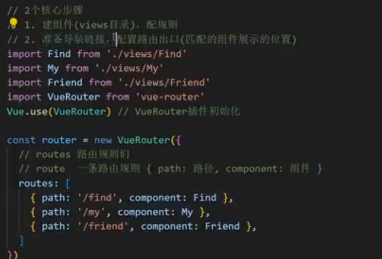


**使用 配合  <a> 确定路劲，和路由出口使用**


### 路由模块化

将路由创建在 router  文件夹中  并用  .js  形式创建

例子：

在index 文件中 创建Router

```
import DongTai from '@/components/DongTai.vue'
import MsG from '@/components/MsG.vue'
import PinDao from '@/components/PinDao.vue'

//导入 分页 的模块

import Vue from "vue";
import VueRouter from "vue-router";
Vue.use(VueRouter)
//导入Vue 和VueRouter  并让Vue去use VueRouter

const router= new VueRouter(
    {
        routes:[
            {path:'/msg',component:MsG},
            {path:'/pindao',component:PinDao},
            {path:'/dongtai',component:DongTai},

        ]
    }
)
//建立路由规则


export default router

//导出default对象 router
```


在main.js 中导入并使用router

```
import router from "@/router/index";

new Vue({
  render: h => h(App),
  router:router
}).$mount('#app')

```


在app.vue中  使用

```
 <div class="footer">
    <router-link to="/msg" class="son">myMSG</router-link>
    <router-link to="/pindao"  class="son">myChaneal</router-link>
    <router-link to="/dongtai"  class="son"> myFrinedCycle</router-link>
  </div>
```


### router-link的使用

router-link 该组件可以用来  取代a 标签

它可以实现跳转   要配合to属性  其本质还是a标签  **并且to不需要去加“#”**


并且它会在 跳转后 **提供自己默认高亮的类名**  可以直接设置高亮的形式 

```
 <router-link to="/msg" class="son">myMSG</router-link>
```

**之后就可以在style中设置**（它给予的类名叫做**router-link-active** ）

```
<style>
.footer .router-link-active
{
  background-color: aqua;
}
</style>
```


这个两个高亮类名  **还可以 自定义名称**

具体 在 实例化VueRouter时进行

```
const router= new VueRouter(
{
routes:[...]，
linkActiveClass:"自定义类名1"，
linkExactActiveClass:"自定义类名2"
})
```


### router-link两种传参


#### 1 ？查询式传参

设置跳转

```
 <router-link to="/msg?参数1=value1&参数2=value2" > myMSG  </router-link>
```


在对应组件获取

```
{{$route.query.参数名}}  //在结构中使用

console.log(this.$route.query.参数名)
//在export default中使用
```


**优点：比较适合 传多个参数   使用&隔开**


#### **2 动态路由传参** 

在router中配置动态路由

```
path:"/msg/:参数的名称"
```

设置跳转

```
 <router-link to="/msg/参数值values" > myMSG  </router-link>
```


在对应组件获取

```
{{$route.params.参数名}}  //在结构中使用

console.log(this.$route.params.参数名)
//在export default中使用
```

传递单个参数方便

**但是必须要传参数**

如果只传入了  "/msg"  无法匹配到对应组件

如果想不加参数也跳转  在router配置path时候加个  ？

```
path:"/msg/:参数的名称?"
```


### Vue路由重定向

网页打开时 url默认是  /   此时没有匹配到组件 网页会出现空白

重定向：匹配path后 强制更改path路径

语法：在router中

```
routes:[
{path:'/',redirect:"/home"},
{path:'/home',component:Home},
]
```

这样打开一个页面后 就直接跳转加载到 home了


### VUE 404页面

语法：

```
routes:
[
{path:"*",component:NotFound}
]
```

注意这个一定要写在路由的最后面 

**因为*代表全选 **

**路由的匹配是自上而下的  当上面的匹配全部都找不到时候**

**才会进入404 页面**


### Vue路由  的模式设置

**哈希路由 默认项  路径带#**

**history路由    不带#号 **  设置方法：

```
const router= new VueRouter({
routes:[...],
mode:"history"
})
```


### 按钮跳转  （事件响应跳转）


##### 1 path路径跳转

```
this.$router.push("路由路径")
```


##### **2 name命名路径跳转**

在实例化router  定义路径的时候

```
routes:
[{name;"home",path:/home,component:Home}]
```

添加上了一个 是home 的name

使用

```
this.$router.push({
name:"home"
})
```

**适合在路径比较长的跳转中实用**


##### **3 传参**

？查询式传参

```
this.$router.push("路由路径?参数名=参数值")
```

动态路由传参

```
this.$router.push("路由路径/参数值")
```


使用name时候  还是构建对象

**？查询式传参**

```
this.$router.push({
name:"home"，
query:{
参数名1:value1，
参数名2:value2
}
})
```

**动态路由传参**

```
this.$router.push({
name:"home"，
params:{
参数名1:value1，
}
})
```


## 28 自定义项目


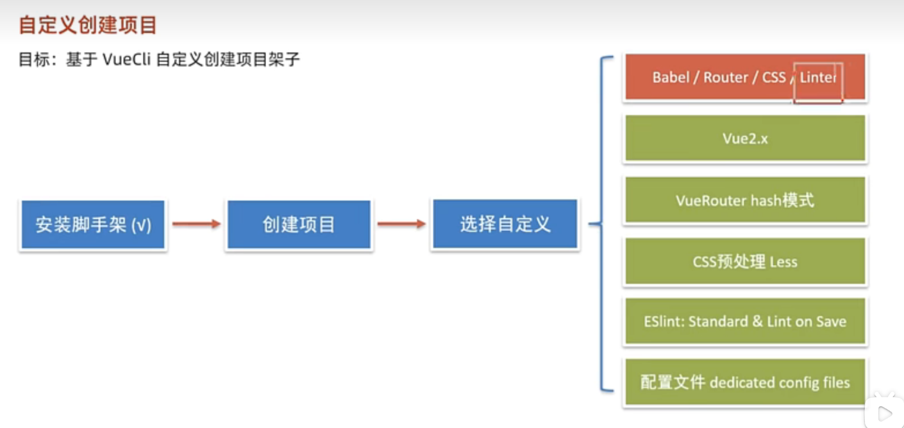

**具体操作:**


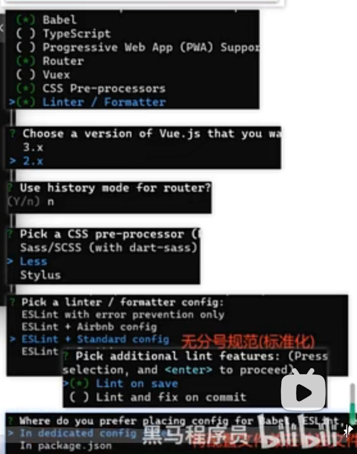


## 29 VUEX

vue状态管理工具  

**主要是实现多组件共享同一份数据**

**多组件共同维护一份数**

特点： 简写 响应式


### 初始化VUEX

1 安装

```
npm i vuex@3 -g
```


2 新建文件夹 store  并创建index.js  


3  对vuex实例化 产生store

```
import Vue from "vue";
import Vuex from 'vuex';

Vue.use(Vuex)
const store = new Vuex.Store()
export default store
```


4 在main .js上挂载 VueX

```
import Vue from 'vue'
import App from './App.vue'
import router from "@/router/index";
import store from "@/store";
Vue.config.productionTip = false

new Vue({
  render: h => h(App),
  router:router,
  store:store
}).$mount('#app')

```


### state状态

state中提供唯一的公共数据源  所有组件都可以使用共享的数据

```
const store = new Vuex.Store(
{
state:{
      count:101,
      family:['ann','ken','jack']
}
})
```


数据使用：

#### 1 通过store直接访问数据

 

```
模版中:            {{$store.status.count}}  
组件逻辑script中：   this.$store.status.count
js模块中:  先import导入store   再用store.status.count 使用数据
```


#### 2      辅助函数mapState


mapState可以帮助直接把**state中 数据** **自动映射**到  组件的**计算属性**中  

在组件中实用方法：

``` 
import{mapState } from 'vuex'  //先导入

export  default{
computed:
{
...mapState(["数据名1"，数据名2])
}
}
```


这样在 组件中就可以直接使用 数据名1 ，


而不需要写$store.status.数据名1


**...mapState就是展开运算符映射的意思**


### VUE的mutations

vuex同样遵循单项数据流 ，组件中不能直接改仓库的数据


如何开启严格模式（组件中不能直接改仓库的数据)

```
const store=new Vuex.Store({
strict:true,
state:{
...
}
})
```


**子组件修改state数据的方法**：


**在store中定义mutation 对象 在该对象中存放修改  state的方法** 


##### 1 无参方法版

```
const store=new Vuex.Store({
strict:true,
state:{
count:0
}
mutations:{
add(state)
{
state.count++
}
}
})
```


在mutation 对象中的自定义add方法  **第一个形参一定要是state**

组件使用

```
this.$store.commit('mutation 中的自定义方法')
```


##### 2 有参方法版

```
const store=new Vuex.Store({
strict:true,
state:{
count:0
}
mutations:{
add(state，value)
{
state.count+=value
}
}
})
```

**传入两个参数 第一个形参固定是state， 第二个为组件传入的参数**

组件使用：

```
this.$store.commit('mutation 中的自定义方法'，value)
```


**注意：最多只能自行传入 一个参数 因此 如果有多个参数** 

**要先去将他们转化成一个obj 再将这个对象当做参数传入**


##### mapMutations

和mapstates很像  是将mutations中的方法映射到组件的methods中。

```
import{mapMutations } from 'vuex'  //先导入

export  default{
computed:
{
...mapMutations(["方法1"，‘方法2’])
}
}
```

调用：

```
this.方法1()
```


### VUEX的异步函数actions

mutation中的操作必须是同步的  当使用axios等异步请求时 

需要将异步函数函数封装在 store的actions对象中

##### 使用

```
const store=new Vuex.Store({
strict:true,
state:{
count:0
}
actions:{
   sendReuist(context,value)
   {
    axios({
        method:"GET",
        url: ' http://localhost:3000/posts/1',
          }).then(function (resonce){
        
        console.log(resonce)
    })
   }
}
})
```

自定义异步函数 sendReuist  函数内部实现发送get请求  并打印response


##### 组件调用异步请求

```
this.$store.dispatch("sendReuist",value)
```


##### mapActions

用法同mapMutations   是将cctions中的方法映射到组件的methods中。

```
import{mapActions } from 'vuex'  //先导入

export  default{
computed:
{
...mapActions(["方法1"，‘方法2’])
}
}
```


### Vuex的派生状态getters

类似 Vue中的计算属性  这些派生状态依赖于state

```
const store=new Vuex.Store({
strict:true,
state:{
count:10
}
getters:
{
finalmoney(state)
  {
   return state.count*10
  }
}
})
```

finalmoney就是派生状态


mapGetters 类似mapState  也是将属性映射到组件的 computed中 简化代码

```
import{mapState } from 'vuex'  //先导入
import{mapGetters } from 'vuex'  //先导入

export  default{
computed:
{
...mapState(["数据名1"，"数据名2"])
...mapGetters["派生状态1"，'派生状态2'])

}
}
```


## 30 VUEX的模块化

将其拆分到不同的  store/modules/ XX.js

**模块使用：**


```
const state={}
const mutations={}
const actions={}
const getters={}

export default{
state,
mutations,
actions,
getters
}
```


**store接收**

```
impo user form './modules/user'

const store= new Vuex.store({
modules:{
user:user
}
})
```


### 模块中各状态和内置方法的访问方法：


#### 1  直接访问：

```
$store.state.模块名.数据名   //访问模块中state的数据

$store.getters['模块名/内部状态名']  // 访问模块中的gatters
     
$store.commit（'模块名/方法名',values额外参数）  // 访问模块中的mutations

$store.dispatch("模块名/方法名",values额外参)    // 访问模块中的actions 
```


如果不开命名空间     子模块的state还是会被挂载在**根级别**的state中

**子模块的mutations和actions 还是会被挂载到全局**  


#### 2 map映射根级别


```
mapState(['数据名'])
mapGetters(['数据名'])
mapMutations(['方法名'])
mapActions(['方法名'])
```


#### 3 map映射 子模块级别  （需要开启命名空间）


**模块使用：**

在模块的 .js 文件中 开启命名空间

```

export default{
state,
mutations,
actions,
getters，
namespace:ture  // 开启命名空间
}
```

**这时候各个属性和方法都被挂载到了子模块中**


此时使用  map映射：


```
mapState('模块名'，['数据名'])
mapGetters(['模块名'，'数据名'])
mapMutations('模块名'，['方法名'])
mapActions(['模块名'，'方法名'])
```

