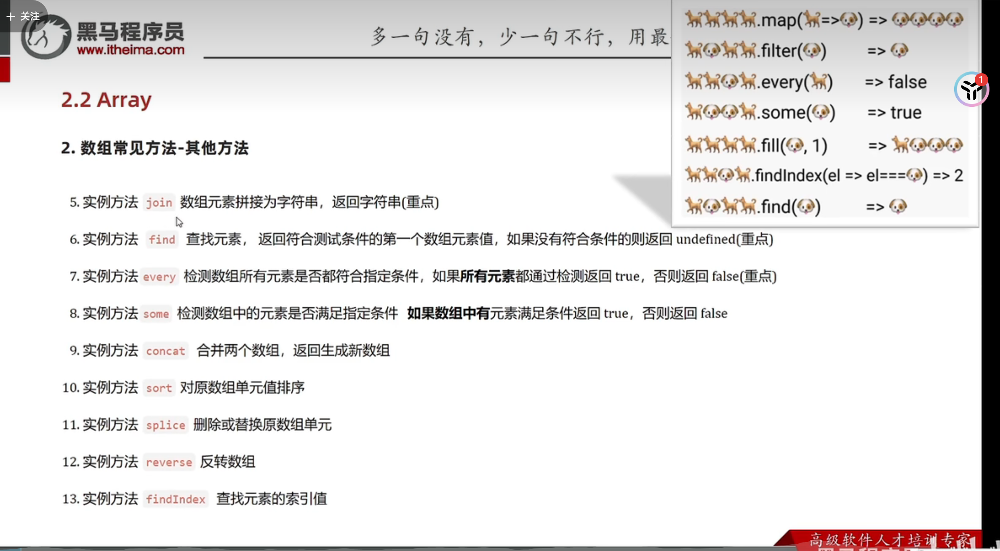
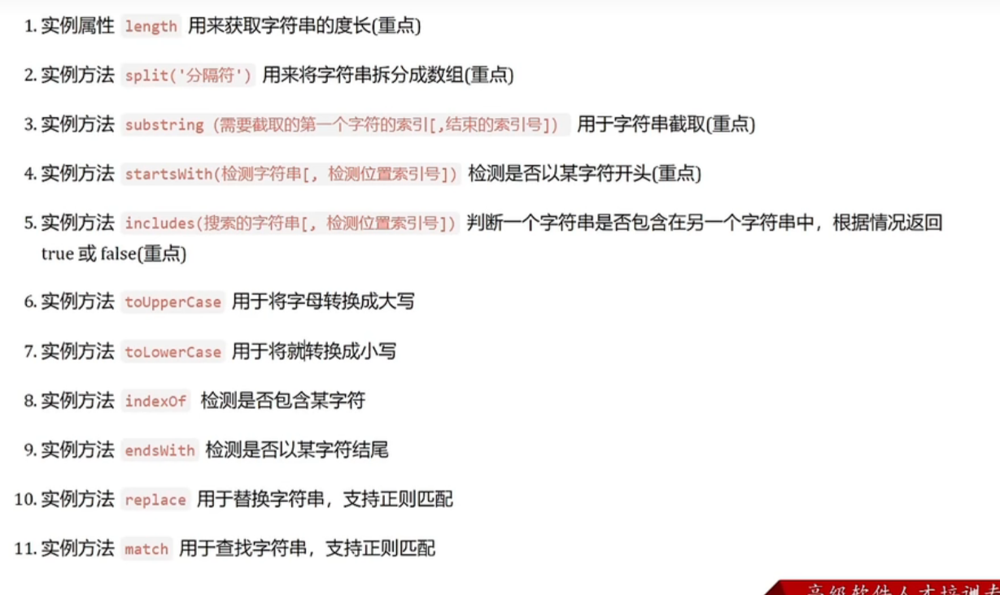

## 1 作用域和作用域链

#### 1.1 局部作用域

在函数内部和大括号内部声明的变量只能在函数内部访问

**（使用const和let的）**

分为**函数作用域**和***块作用域***（被大括号包着的）


**var定义的是全局变量** 因此不受作用域限制。


#### 1.2  全局作用域


尽量少声明全局变量防止变量污染 


#### 1.3 作用域链

实质 是变量查找机制  先查找当前函数作用域变量

如果找不到 **则逐级查找父级作用域（冒泡）**

**子作用域可以访问父作用域**


#### 1.4 垃圾回收机制


生命周期为：**内存分配、内存使用、内存回收**

全局变量的声明周期一般是**关闭网页**


**简单数据类型：存放在栈中**

**复杂数据类型：数据存放在堆中 栈中保存一个指向该堆区的指针**


内存泄漏：程序中分配的内存由于某种原因 **程序未释放 或者无法释放** 


回收机制：

- 1  引用计数法（过时）

对于每个函数或者变量 存储引用次数的内部属性

当在整个程序中引用次数为0 的时候 就释放内存 清除垃圾

**局限：**出现两个对象或者函数相互引用 易发生内存泄漏


- 2  标记清除法：

扫描从根部出发可到达的对象 凡是可以到达的对象都保留

无法到达的对象 就被清除


#### 1.5 闭包

目的：封装数据 实现数据安全私有   同时保证外部可以访问内部的数据

一个函数对周围状态的引用捆绑，内层函数访问其外层函数的作用域

**闭包=内层函数＋外层的函数中的变量**


写法：

```
function orter()
{
let count=0
    function fn()
    {
    console.log(count)
    }
return fn    
}

const func=orter()

func()  //这样就可以通过调用func函数实现对orter内部变量的访问
```


局限性：易出现  内存泄漏问题


#### 1.6 变量提升

**出现在var 声明的变量中**

实质：

j s代码执行的时候 会先扫描所有的var并留出空间

因此在 先使用var声明的变量 再声明  程序不会报错。


## 2  函数高级

#### 2.1 函数提升 

function关键词和var 一样

在执行的时候会先将function的声明 最先执行

**函数提升能使函数的声明调用更加灵活  但是函数表达式不存在提升**


#### 2.2 函数的参数

**1 剩余参数**

优点：可以设置至少有几个参数  并接受的参数数量无上限）

语法：（以sum函数为例）

```
function sum(a,b,c,...arr)
{
    let ans=0
    
    ans=a+b+c
    
    for(let i=0;i<arr.length;i++)
    {
        ans+=arr[i]

    }
    return ans

}
```

该函数就**限定了至少要传入三个参数  三个之后的参数进入...arr剩余参数**


arr实质上是一个**真数组** 作用域在函数内。


 **2 动态参数**

语法：（以sum函数为例）

```
funvtion sum()
{
 let ans=0
 
 for(let i=0;i<=arguments.length;i++)
     {
       ans+=arguments[i]
      }
 return ans

}
```

arguments实质是伪数组 只有length可以使用

缺点：无法限制最低数量的参数


**3 展开运算符**

...

就是将一个数组展开并传参。

使用场景  求数组最大值最小值 合并数组等

```
最大值：
let maxx=Math.max(...arr)

最小值
let maxx=Math.min(...arr)

合并数组
let newarr=[...arr1,..arr2]
```


#### 2.3 箭头函数

省略function的简写形式

 

```
const sum=(a,b) => {
    console.log(a+b)
}
```


##### 注意事项

**1 如果传入参数有且仅有一个 则可以省略小括号**


```
const double= a =>{
    console.log(a*2)
}
```

只有一个参数 省略小括号


**2 如果执行代码只有一句 可以省略大括号**

**并自动将其作为返回值返回。**

```
const form=document.querySelector('form')
form.addEventListener("click",ev=>ae.prventDefult())
```


**3 箭头函数可以直接返回一个对象**

```
const fn= name =>({username:name})
```

需要在箭头后面加个小括号 表示是要生成一个对象


**4 箭头函数里面没有arguments  只有剩余函数**


**5 箭头函数的this值**

之前的函数 的this是根据**它是如何被调用的从而定义函数的this值** 

而箭头函数**不会去创建自己的this**  它从自己的**作用域的上一层**去使用this

在dom事件回调函数中 使用箭头函数  出现的this指向window  不推荐


## 3 解构

#### **3.1 数组解构**

使用场景

**1 批量把数组中的各个元素按顺序分配给多个变量** 

```
const arr=[1,2,3]

const [a,b,c]=arr
```

典型应用：

交换两个变量

```
let a=1
let b=3 ;
[b,a]=[a,b]

```

注意点：

在 j s 编译的时候 如果**某行的开头是[**元素1，元素2...] 形式

在前一行一定要**记得加分号**

否则会编译识别错误


#### 各种情况：

**1 变量少 单元值多 使用剩余参数 ...arr**


```
const [a,b,...c]=[1,15,14,7,6,5]
```

...c中存储了剩下的数据 防止数据损失


**2 变量多 单元值少  使用预设值反正出现undefined**

```
const [a=1,b=2,c=2]=[2.5]
```

设置默认值


**3 二维或者多维数据转一维**

```
const [a,b,[c,d]]=[1,2,[3,4]]
```

和要被解构的数据格式相同即可


#### 3.2 对象解构


**类似数组解构  对象属性的是要赋给与属性名相同的变量**  


**要注意解构的变量名不要和外面的变量名冲突**


**使用的是大括号！！！**！

```
const user={
       name:"xiaoming",
       age:18
          }

const {name,age}=user
```

 

如果注意解构的变量名和外面的变量名冲突 **解开冲突**的方法：

```
 const { uname:name,age}={uname:lee,age:18}
```


##### 多级对象结构

```
const pig={
name:lee,
family:{
        mom:'mm',
        sister:’乔治‘
        father:'dd',
        
       }
}


解构：
const {name,family:{mom,sister,father}}=pig

格式相同就行
但是调用小解构 的时候 要注明大结构的名字


```


## 4 arr的forEach方法

用来遍历数组中每个元素   只遍历 不返回

```
被遍历的数组.forEach(function(ele,index){

//函数体
})
```

参数中第一个ele必须要声明  第二个index索引  可以不写。


## 5 arr的fillter方法

用于筛选  

**return 一个新的数组**（该数组包含所有符合条件的元素）

语法：

```
被遍历的数组.filter(function(ele,index){
return 被筛选的条件
})
```

ele必写 index 可选

如果没有符合条件的 返回空数组  

不会影响原来的旧的数组


例子：

```
const score = [50, 15, 66, 85]
const newscore = score.filter(ele => ele > 60)
console.log(newscore)
```

使用了箭头函数 减少了代码量


## 6 自定义对象构造函数

类java 构造函数

比如定义一个Pig类

```
function Pig(name='lee',age=20) {
    this.name = name
    this.age = age
}
```

同样也可以设置默认值

俩约定：

1 命名是以大写字母开头。

2 只能由new操作符来执行。


同时构造函数自身的属性和方法  被成为静态属性和静态方法

声明只能在 构造函数外进行

**1 静态成员只能通过构造函数访问**

**2 静态方法中this指向构造函数**


## **7 js 内置 结构对象和内置方法**

实质上 str num Boolean和null等基本数据类型

**在js中也也进行了对象化**


#### 常用引用类型 及其内置方法

##### Object 的keys values和assign方法


 **Object**.keys(对象)和 **Object**.values(对象)

**返回一个数组** 数组各元素是该对象的各个键或者各个value


```
const arrkeys= Object.keys(pig1)
console.log(arrkeys)

const arrvaluse= Object.values(pig1)
console.log(arrkeys)


//结果：
['name', 'age', 'sayhi']
['lee', 20, ƒ]
```


**Object.assign   (要赋给的对象，蓝本对象)**

```
const smallpig = new PIG()
Object.assign(smallpig, p2)
```

实质上就是拿着蓝本对象 对要赋给的对象进行一次键值对的更新

有就更新 没有就添加


##### arr的reduce方法

reduce **返回累计处理的结果** 常用与求和

语法：

```
arr.reduce(function(prev, now){},起始值)
```

第一个参数是上一次的返回值

第二个参数是本次的元素的值

第一次执行的时候是prev是初始值


例如数组求和


```
arr.reduce((Prev,now)=>Prev+now,0)
```


其他方法：




##### arr的find方法


语法：

```
arr.find(function(ele){

函数体;
return 条件；
})
```


例如找到数组中 的对象的品牌名字是华为

```
let  huaweiphone=arr.find(ele=>ele.tagName==="华为")
```

返回的 是满足return条件的 arr中的第一个元素


##### arr的some和every方法


语法：

```
arr.every(function(ele){
return 判断语句
})
```

例如判断一个对象数组里面是不是价格全部大于50块


```
let flag = arr.every(ele=>ele.price>=50)
```


some方法和every使用相同 

**some方法是数组中只要有一个符合条件  就返回true**

**注意！！！！如果数组为空     那么every和some在一切情况下都会返回ture**


##### 伪数组转真数组 的Array.from()静态方法

例如：

```
const truearr=Array.from(document.querrySelectAll('li'))
```

**querrySelectAll返回的伪数组转换为数组后就可以使用数组的内置方法**


##### String常用方法




**String方法split  字符串分割**

return一个数组

```
const str="a,b,c"
const arr=str.split(",")
```


**String方法startWith  判断开头**

return true或者false

```
const str="原神启动！！"

str.startWith("原神")  //true
str.startWith("启动")  //false

后面还可以加第二个参数 index  决定从第几个索引开始 判断

str.startWith("启动"，2)  //true
```

**相近方法：str.endWith()**


**String方法  substring()字符串截取**

```
const newarr=str.substring(5) //从第五个索引开始截取字符串到末尾

const newarr=str.substring(5，8) //从第五个开始截到第七个  第八个不截取。

```


**String方法  includes()判断子字符串**


返回true或false。

```
const str1="原神启动！！！"
const str2=“原神”

console.log(str1.includes(str2)) //ture
```


Number 的toFixed（）方法

设置精确的位数  四舍五入

```
const  number=114.156
let new=number.toFixed(2)

//114.15
```

 


## 8 JS的面向对象编程


**类java c 类的面向对象**  

**但是 对象的构造函数中内置方法 会存在浪费内存的问题**


#### **8.1 原型 prototype**

通过原型分配的函数 是所有对象所共享的

把不变的方法直接定义在protoytype上 实现方法共享:

例如  自定义arr的原型函数


```
const arr=[1,5.98,4]

Array.prototype.myMax=function()
{
return Math.max(...this)
}


Array.prototype.myMin=function()
{
return Math.min(...this)
}

Array.prototype.mySum=function()
{
return  this.reduce((prev,now)=>prev+now,0)
}

```

注意：构造函数和原型对象中的**this都指向了实例化的对象**。


#### 2 构造函数 实例对象和原型 prototype之间的关系 


**prototype和实例对象**里面会有 **属性constructor** 该属性指向构造函数

而实例对象 中还有属性_ _proto_ _   该属性指向它的原型prototype

指向 构成该原型prototype的 构造函数 

例如：

```
function Pig(age,name)
{
    this.age=age
    this.name=name
}

const p1= new Pig(18,"LEE")

console.log(p1.__proto__)//返回原型

console.log(p1.__proto__.constructor)//返回构造函数 f:Pig(age,name)

console.log(p1.constructor)//返回构造函数 f:Pig(age,name)
```

注意点：

1 _ _ proto_ _是js非标准属性  同时是readonly属性

2  [[prototype]]和_ _ proto_ _意义相同

3  如果要给构造函数的prototype 添加多个方法 使用大括号的时候 一定要在**内部手动添加constructor属性** 防止原来的内容被覆盖


## 8.3   原型继承与原型链

在本身的构造函数之上 再去继承别的类 使之成为该构造函数的父类。


注意 **每次继承操作后  要将本身的构造函数的prototype的constructor属性重新指向该构造函数本身**。

语法：

```
function Dad(){
this.属性1=value1
}
、
function Son()
{
相关属性...
}

Son。prototype=new Dad()

Son.prototype.constructor=Son
```

被称为基于原型对象的继承


**使得不同构造函数的原型对象以一种链状形式关联在一起 被称为原型链**


**元素属性在原型链上的查找规则**：


自身==》 它的原型==》 原型对象的原型==》 一直查找到Object为止


**instanceof 运算符**


a   instanceof  b

**检测a的原型链上有没有 b**

**返回Boolean值。**

```
console.log(p1 instanceof Pig)  //ture
console.log(p1 instanceof Array) //false
console.log(p1 instanceof Object) //ture
console.log(简单数据类型 instanceof Object) //false

```


## 9 浅拷贝和深拷贝


#### **9.1 浅拷贝**

拷贝的是地址

只能用**于内部全是简单数据类型**的拷贝

如果是**简单**数据类型则 拷贝**值**  如果内部子元素是**复杂数据**类型 拷贝**地址**

（单层对象，没问题 ，多层对象就有问题。）

常见方法

```
const obj={
name:"lee",
age:10
}

const newobj={...obj}
// 使用...展开

const newobj={}
Object.assign(onj,newobj)
// 使用Object的assign方法实现浅拷贝。
```


#### 9.2 深拷贝

拷贝的是对象 不是地址。

实现方法：

##### 1 递归实现

```
const obg={age:18,
    money:[50,57,55],
    family:{
        son:'lee',
        dad:'bob'
    }
}
const newobj={}
//给定原始数据  创建要被克隆的对象


function  deepcopy(newobj,old)
{
    for (let k in old) {
        if (old[k] instanceof Array)
        {  newobj[k]=[]
            deepcopy(newobj[k],old[k])
        }

        else if (old[k] instanceof Object)
        {
            newobj[k]={}
            deepcopy(newobj[k],old[k])
        }
        else
        {
            newobj[k]=old[k]
        }

    }
}
// 定义深拷贝函数

deepcopy(newobj,obg)
//调用
console.log(newobj)
```

注意事项：

1 每次递归前都要**先创建一个新的 []或者{}** 去承接再次调用时的获得数据

2  instanceof  **判断要先判断Array 再去判断Object**  

因为Array类也属于Obj类 **要注意顺序**


##### 2  调用lodash库函数

```
const new1 = _.clone(obg)
```


##### 3 JSON转换 

```
const new1 = JSON.parse(JSON.stringify(obg))
console.log(new1)
```


## 10 异常处理


#### 1 throw

throw 抛出异常 并**中断程序的执行**

在console中显示错误信息

常常和catch搭配使用


#### 2 try catch  finally

catch捕获异常后

如果不加throw  **程序继续执行**(finally模块和接下来的代码都执行)

加上throw  **程序中断**（只执行 finally模块）


#### 3 debugger


相当于在控制台上

打上断点标记


## 11 this 自定义


#### 11.1 apply和call函数

特点：

在改变this'指向的同时  执行该函数


语法：

```
fun.call(this指向，参数1，参数2...)

fun.apply(this指向，数组[])
```

其返回值就是函数的返回值 其实质就是在执行函数


#### 11.2 bind函数

特点：改变this的值 但是不执行函数  实质是克隆生成了一个this改变的类似函数

语法：

```
fun.bind(更改后的this指向)
```

其返回值是  克隆出来的 **原函数的拷贝（新的函数）**

应用：改变定时器内部的this指向

```
btn.addEventListener('click',function(){
this.disabled=true
setTimeout(function(){
this.disabled=false
}.bind(btn),60000)
})
```

在setTimeout定时器里面 this原本指向的是window 

 **需要通过bind函数更改this指向**


## 12 防抖

**单位时间内 频繁触发的事件 只执行最后一次**

**使用场景：搜索栏   表单输入验证**


#### 方法1：lodash内置函数


```
_.debounce(要执行的函数，事件停止多少秒)
```


例如鼠标移动的事件监听器：

```
box.addEventListener("mousemove", _.bebounce(fn,500))
```

鼠标停止移动500毫秒后再执行

这里addEventLintener的第二个参数     传入的就是lodash内置函数


#### 方法2：  手写函数

定义定期器变量，每当事件被触发，

先判断此时有无定时器  有的话就删掉原来那个定时器

如果没有定时器 就开启定时器。

定时器内调用要执行的函数。

```
function deboune(fn,t)
{
    let timer
    return function (){
        if(timer) clearInterval(timer)
        timer=setTimeout(function (){
            fu()
        },t)
    }
}
btn.addEventListener('click',deboune(function () {
    500毫秒后要执行的函数体
},500))
```


## 13 节流**throttle**


和防抖的区别：

防抖 ：单位时间内 频繁触发事件 只执行最后一次

节流：单位时间内  频繁触发事件  只执行一次 

**防抖：表单格式验证等**

**节流：鼠标移动mousemove  页面尺寸缩放 滚动条滚动scroll等**


#### 方法1：lodash内置函数

和防抖很相似  

```
_.throttle(要执行的函数，事件停止多少秒)
```

例如鼠标移动的事件监听器：

```
box.addEventListener("mousemove", _.throttle(fn,500))
```


每500ms 只执行一次该函数  

这里addEventLintener的第二个参数     传入的就是 lodash内置函数


#### 方法2：手写节流函数

每次监听到事件 先判断有无定时器 如果没有定时器  setTimeOut

如果有  就不开启

```
function throttle(fn,t)
{let timer =null
return function ()
    if(！timer){
    timer=setTimeout(function()
    {
    fn()
    timer=null
    },t)

    } 
}

//在setTimeout中是无法删除使用clearTImeout（timer）
删除方法：timer = null
```


## 14  补充：视频事件ontimeupdata和onloadeddata


**ontimeupdata 表示视频的播放位置发生改变的时候 触发的事件**


**ontimeupdata 表示每次进入视频的该页面  视频从哪里开始加载**


通过localStorage 存储视频的currentTime属性


再下次打开网页的时候监听ontimeupdata事件  

触发时将视频currentTime属性移动到上次记录的值 

可以实现视频播放记忆定位


**但是ontimeupdata 的触发频率很高  因此使用throttle节流优化**