#             react学习

## 1 创建开发环境

**终端创建项目**：

terminal输入

```
npx create-react-app  创建的项目的名字
```


**服务启动:**

terminal输入

```
npm start
```


index.js 文件解析：

```
import React from 'react';
import ReactDOM from 'react-dom/client';
import App from './App';
//导入两个核心包和 app根组件

const root = ReactDOM.createRoot(document.getElementById('root'));
//把名叫app的根组件渲染到id为root的dom节点上

root.render(<App />);
//启动

```

**与v3相比 没有main.js**


## 2    JSX特性

  **在js代码中    也可以编写HTML的模版结构**

 

**他具有HTML的声明式模版的写法 也具有js的可编程能力**


### 1 js表达式的识别

**使用大括号语法 {}  来识别js中表达式**

```
const count=100;

function doubleCount()
{
const Newcount=count*2
return Newcount
}

```


```
function App() {
   return( <div >
    
   {'这是一个APP'}  //识别引号中的字符串
   
   {count} //识别js变量
   
   {doubleCount()} //识别函数调用或者方法调用
   
   <div style={{color:red}}> this is a div！
   </div>
   //第一个大括号是识别js对象 
   //第二个的大括号代表一个对象 内部属性为color:red
   
    </div>)
}
export default App;

```


### 2   map  遍历渲染列表

使用map  直接返回一个html框架即可

例如对下面这个list的渲染

```
const list=[
{name:"lee",age:18,id:1},
{name:"boo",age:19,id:2},
{name:"abe",age:8,id:3},
{name:"lte",age:58,id:4}

]
```


app中遍历渲染 语法如下：

```
function App() {
   
   return(
       <ul>
           {list.map(item => <li key={item.id}>名字是{item.name}</li>)}
       </ul>
   )
}
export default App;
```

注意：

**1 list.map要被{}包裹**

**2 要给 li加上独一无二的key  原因和v中的v-for一样**

 当不使用key时候  在对list增删改查的时候  vue会保留前几项的css样式 

导致增删改查结果不准去

因此要使用

**key属性=‘’唯一标识‘’**（一般是id）

**便于vue进行列表项的正确排序复用**


### 3    &&或三元运算符实现 逻辑控制

```
const flag=false
function App() {
   
   return(
     <div>
         {flag&&<div>我是1号div</div>}
         //使用&&  只有flag为真 才打印后面的html
         
         {flag?<div>我是2号div</div>:<div>我是3号div</div>}
          //使用三元运算符
         
     </div>
   )
}
export default App;

```


### 4 事件绑定

on+事件名称 遵循驼峰命名法 比如onClick

```
function App() {
   
    const  clickfn=(e)=>
    {
        console.log('按钮被点击了')
        console.log(e)
    }
    return(
        <button onClick={clickfn}>请点击</button>
    )
}
export default App;
```


**参数 e 为事件对象** 一般使用e.target 属性。


如果想要带传参 做以下修改：对事件处理函数 clickfn

```
const  clickfn=(自定义参数，e)=>
    {
        console.log('按钮被点击了')
        console.log(e)
         console.log(自定义参数)  
    }
    
    
```


对按钮增添的属性：

```
   <button onClick={(e)=>clickfn(传入的实参,e)}>请点击</button>
```


注意这里不能直接写函数调用 而需要一个函数引用。

**还要注意是先写传入的实参, 再写e  顺序不能乱**


### 5  react的组件化使用

其中的组件实质上就是    function函数 使用<></>直接在另一个 function中插入使用 实现组件化

例如 一个 button 类型的 组件


```
const Button1 =()=>
{   const  clickfn=(e)=>
{
    console.log('按钮被点击了')
    console.log(e.target)

}

    return (
        <button onClick={(e)=>clickfn(e)}>请点击</button>)
}
// function箭头函数 定义了一个叫做Button1的组件


function App() {

 return(
    <div> <Button1></Button1></div>
         //在APP中使用该组件
 )
}


export default App;
```


**注意事项：** **组件名称首字母一定要大写 否则react无法识别 导致无法成功渲染**


### 6 useState 声明 响应式状态量


useState上一个react hook 函数 允许  添加响应式状态量

使用方法：


```
import {useState} from "react";  //先导入react包中的useState

const Button1 =()=>
{
    let [count,setCount]=useState(100) 
    
    //声明list组 第一个参数为响应式变量的名字 第二个为修改状态量的方法  useState传入的参数为初始值。
    
    const  clickfn=(e)=>
{
    setCount(count+1)  //调用修改状态量的方法
    console.log('按钮被点击了')
 

}

    return (
        <button onClick={(e)=>clickfn(e)}>请点击{count}</button>)


}
function App() {

 return(
    <div><Button1></Button1></div>
 )
}
export default App;

```


**修改状态 只能调用set... 的方法**


**如果直接更改 state变量无法实现响应式的效果**


对于复杂对象状态的修改：

```
const Button1 =()=>
{
    let [person,setPerson]=useState({
        name:'lee',
        age:19
    })
    const  clickfn=(e)=>
{
    setPerson({
        ...person,
        name:'boo'
    })

    console.log(person.name)
    console.log('按钮被点击了')


}

    return (
        <button onClick={(e)=>clickfn(e)}>请点击{person.name}</button>)


}
```

**useState 里面传入 {} 包裹的复杂数据对象**


**setState函数修改时候  传入 格式也用 {}包裹**

```
setPerson({

...person,  //先将原来的对象展开
name:'boo'   //同一个key  后定义的value可以覆盖前一个value  故实现了对象的内部属性的修改

})
```


### 

##  3  react的类名对css样式控制


使用独立的 .css文件控制样式

在使用样式的组件js文件中导包：

```
import  './index.css'
```


使用时候不能是 class='...'

而是


```
<div className='......'></div>
```

**在react中用className      去替换原本的class**


## 4 类名控制的优化

**使用classNames函数**

语法：

以tab栏切换的active类名控制为例子;

```
className={classNames('nav-item',{active:type===item.type})}
```

classNames函数实质是返回了一个字符串  

**在函数内部 用{}里面填充判断语句 来展示或者隐藏不固定的样式。**

```
{样式类名:判断语句}
```


## 5 ref获取dom元素


语法和v3很类似

先导包：

```
import {useRef} from "react";
```


再使用：**使用useRef 创建空的ref  再和dom元素绑定**

​               **ref.current 代表所绑定的 dom元素对象**    

```
function App() {
    const textRef = useRef(null)  //先
    const showText = () => {
        console.log(textRef.current.value)
    }
    return (
        <div>
          
            <input type="text" ref={textRef}/>  //绑定
            <button onClick={showText}>获取文本框内容</button>
        </div>

    )
}

export default App;

```


## 6  随机id生成插件和Date格式化插件

#### 随机id生成插件;

安装：

```
npm i uuid
```

导包：

```
import {v4 as uuv4} from 'uuid'
```


使用：

```
uuv4()   //生成一个随机不重复的id
```


#### Date格式化插件

安装：

```
npm i dayjs
```

导包：

```
import dayjs  from 'dayjs'
```

​    

使用：

```
dayjs().format(占位符)
```


占位符使用如下：


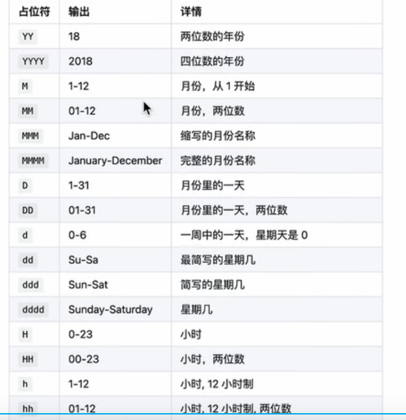

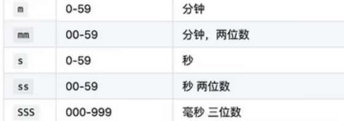


## 7      父子组件通信


### 父传子：

类似v3  

父组件使用子组件：

```
function App() {
    const name='leebo'
    return (
        <div>
            <Button1 ex={name}></Button1>
           
      </div>

    )
}
```

格式：

```
ex={要传入的东西}  可以是简单 或者复杂数据类型 或者是fn 甚至是XML语言。
```

**传入了一个把name赋给一个叫做ex的值给子组件**


子组件承接：

子组件的箭头函数内部声明 props 对象  父组件传递的ex就是props对象中的一个属性。

```
const Button1 = (props) => {
   
    return (
        <button>请点击{props.ex}</button>)
 

}
```

使用：{props.ex}


**props是只读  无法在子组件中修改。**


#### 特殊的props  ：props.children

把内容嵌套在子组件标签中   子组件内会自动在叫做children的props属性中接收该内容。

```
function App() {
    const name='leebo'
    return (
        <div>
            <Button1 >
            <div>helllo world </div>  //内容嵌套在子组件标签中
            </Button1>
       </div>

    )
}
```


子组件接受使用：

```
{props.children}
```


### 子传父：

实质是父传递给子组件一个修改方法  子组件通过这个修改方法 去修改父组件的值

```
const Button1 = (props) => {
const  thismsg = 'hello world'
    return(
        <div>
            <button onClick={()=>props.abcChange(thismsg)}>发送给父组件</button>
        </div>
    )

}


function App() {
   const change=(msg)=>
   {
       console.log(msg)
   }

   return(
      <div>
          <Button1 abcChange={change}></Button1>
      </div>
   )
}

export default App;

```

**父亲传递给子组件一个叫做 abcChange的 函数 子组件调用 传递过来的函数  实现对父组件的值传递**。


### 利用父子通信和状态  实现 兄弟组件的通信：

目的  SonA传递信息给SonB

实现思路：

SonA先通过 子传父  传递信息给父组件

在父组件中定义state状态量  将传递过来的值 进行setState

在将这个state 值使用 父传子通信 传递给组件SonB。


## 8  隔代通信

**使用creatContext**

语法：

导包：

```
import {createContext, useContext} from "react";
```

创建实例化Context对象：

```
const msgContext= createContext()
```


在祖先组件中

**使用：<msgContext.Provider value={msg}>**

**</msgContext.Provider> 这对标签包裹住 子组件的标签  value={ } 传入要传递给后代的值**

```
function App() {
const msg='hellowold'

   return(

         <msgContext.Provider value={msg}>
            <div> <Son></Son></div>
         </msgContext.Provider>

   )
}
```


**后代组件使用：useContext(Context的名字)**

```
function SonSon(){

    const msg=useContext(msgContext)  //调用msgContext的value
    return(<div>
        <div>我是SonSon</div>
        <div>{msg}</div>

    </div>)
}
```


## 9 useEffect       

 

用于在react中创建不是 由于事件引起的 而是渲染本身引起的操作：

例如：发送ajex请求 修改dom等等 

导包：

```
import {useEffect} from "react";
```

使用语法：

```
useEffect(()=>{
//执行额外的操作 如发送请求获取数据等等 比如：
async function getData()
{
const res = await fetch(URL)
const jsonRes=await res.json()
}
getData()  //在声明完方法后一定不要忘记调用
},[])
```

第一个参数是一个回调函数

第二个参数**是依赖项参数 数组** 为[]时候 只在渲染的时候执行一次

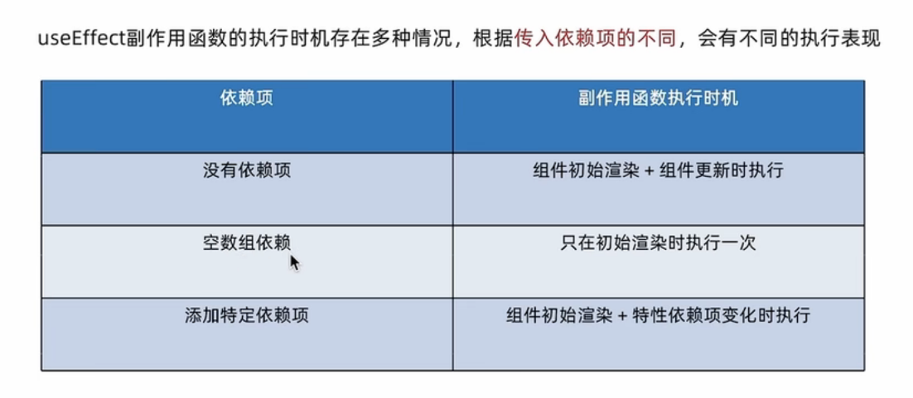


### useEffect 清除副作用：

比如在useEffect的回调函数中声明了一个 计时器 想要卸载该组件的时候 就要把这个定时器再次清理掉

语法：return()=>{}清除

```
useEffect(()=>{
//执行额外的操作 如发送请求获取数据等等 比如：
const timer = setINterval(()=>{
console.log('hello world')
},1000)


return()=>{
clearInterval(timer)
}

},[])
```


## 10 自定义hook函数

都是要以use开头

封装一些可以复用的逻辑代码 

**将那些需要暴露出去的状态和 回调函数 以对象的形式return出去**

例如：封装一个toggle 对一个flag状态值每次都可以取反

```
function useToggle(){
const [flag,setFlag] =useState(true)

const toggle=()=>{
setFlag(!flag)
}


return{
value,
toggle
  }


}
```

其他组件使用：

```
const {flag,toggle}=useToggle()  //{}解构出来
```


## 11  hook的使用规则

1  只能在组件或者其他的自定义hook函数中使用


2 不能嵌套在if  for 或者其他函数中  只能在组件的最顶层使用。


## 12 状态管理工具 redux

其作用类似于Vue中的 pinia和vuex


安装依赖：

```
npm i react-redux @reduxjs/toolkit 
```

RTK  工具集合 简化书写方式

react-redux：用来连接Redux和React组件。


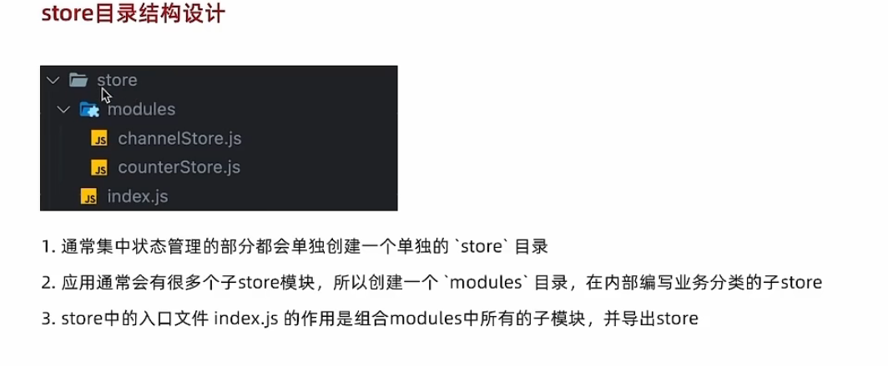


### 子store模块写法：

```
import {createSlice} from "@reduxjs/toolkit";
const  counterStore = createSlice({
    name:'counter',
    initialState:{
        count:101
    },
    reducers:
        {
            increment(state)
            {
                state.count++
            },
            decrement(state){
                state.count--
            }
        }

})
const { increment,decrement} =counterStore.actions
const counterReducer=counterStore.reducer

export {increment,decrement}
export default counterReducer
```

**initialState 很类似 state**

**reducer 很类似 actions**

默认export 出需要的数据即可


### 在index.js中进行各个模块的组合成 一个store

```
import {configureStore} from "@reduxjs/toolkit";
import counterStore from "./modules/counterStore";

const store =configureStore(
    {
        reducer:
            {
                counter:counterStore
            }
    }
)

export  default store
```

reducer 对象内部  采用    名字：各模块的reducer  格式


### store挂载根节点上 

在整个项目的index.js 上

```
import React from 'react';
import ReactDOM from 'react-dom/client';
import App from './App';
import store from "./store";  //导入store
import {Provider} from "react-redux";  //导入Provider


const root = ReactDOM.createRoot(document.getElementById('root'));
root.render(
    <Provider store={store}> <App /></Provider>
   );


```

用 

```
<Provider store={store}> </Provider>
```

去包裹住 <App />


各个组件中使用：

还是先导包：

```
import {useSelector} from "react-redux";
```

再在组件中 使用

```
  const {count} =useSelector(state=>state.counter)
```

{ }解构 出需要的数据（**该数据是响应式的**）

**useSelector(state=>state.需要调用的那个子模块的名字)**  

（名字是在store文件夹中的index'中声明的）


## 13 修改redux内数据


导入包 和 各个子store所expose出的  action

```
import {useDispatch} from "react-redux";
import {increment,decrement} from "./store/modules/counterStore";

```

在组件中使用：

dispatch( action函数名)

```
 const  dispatch=useDispatch()
 
  return(<div>
            <button onClick={()=>{dispatch(increment())}}>+</button>
    </div>)
```


## 14  redux的异步操作请求 实现


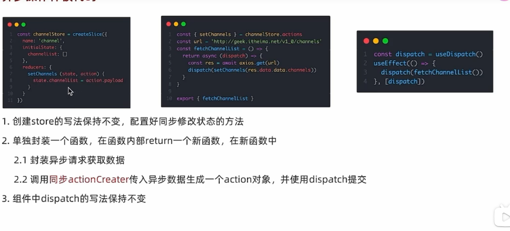

```
import {createSlice} from "@reduxjs/toolkit";
import {useDispatch} from "react-redux";

const channelStore = createSlice(
    {
        name: 'chanel',
        initialState:
            {
                channellist: ['123','hellll'],
                mymy:1011
            },
        reducers:
            {
                setChannels(state, action) {
                    state.channellist = action.payload //state的内部数据被修改为 action返回来的值
                }
            }
    }
)
// 和原来的子模块store写法基本不变

const {setChannels} = channelStore.actions


const url = ''
const fetchChannelList = () => {
    return  (dispatch) => {
        const res = {
                data: {
                    data: {
                    channels:['keee','beee']
                }
            }
        }
        dispatch(setChannels(res.data.data.channels))
    }
}
//在此进行异步操作获取数据  


const reducer= channelStore.reducer
export  default reducer
export {fetchChannelList}
//这次暴露的是单独封装的函数 而不是store内部的action
```


在子组件中： useEfficient后面要跟上一个数组 表示在dispatch的时候重新渲染。

```
 useEffect(()=>{
           dispatch(fetchChannelList())
       },[dispatch ])
```


## 15  路由


**先安装依赖项：**

```
npm i react-router-dom
```


### 1  router的基本创建和使用：

**对于不同的页面 创建pages文件夹 在内部创建不同页面的  . js 文件  实现分区管理**

**同时也创建一个router 文件夹： 在内部用 index.js 去创建路由并配置路径 方便管理。** 

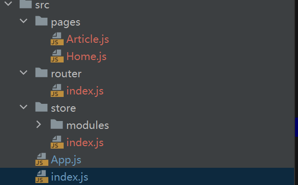


在page中去写各个分页：

比如 Article分页

```
function  Article(){
    return (<div>
        我是文章页
    </div>)

}

export default Article
```


在 router 文件夹的 index.js 中 去配置路由：

先导包：

```
import React from "react";
import {createBrowserRouter} from "react-router-dom";
import Article from "../pages/Article";
import Home from "../pages/Home";
```

createBrowserRouter() 内部要传入一个列表[ ] , 列表内元素是一个个对象 { path:''  ,  element ：react组件 }

最后export default导出：

```
const router=createBrowserRouter([
    {
        path:'/home',element:<Home />
    },
    {
        path:'/article',element:<Article />
    }
])
export default router

```


最后在 总项目index的index.js中使用。

```
import router from "./router";
import {RouterProvider} from "react-router-dom";
```


将<APP/> 替换为<RouterProvider router={**router**}></RouterProvider>


```
const root = ReactDOM.createRoot(document.getElementById('root'));
root.render(
    <Provider store={store}><RouterProvider router={router}></RouterProvider></Provider>
   );

```

即可完成路由


### 2  路由跳转


#### 声明式导航

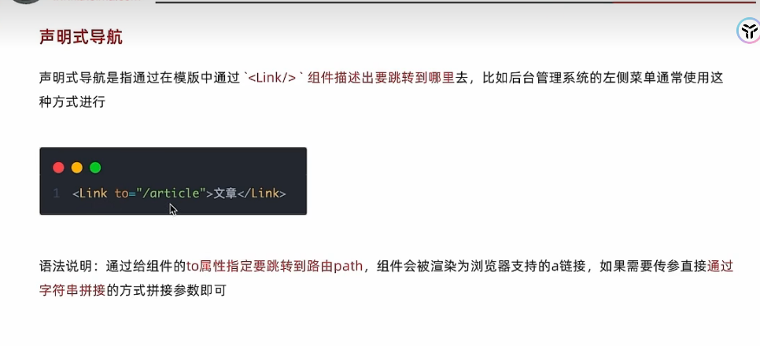

导包：

```
import {Link} from "react-router-dom";
```

语法：

```
<Link to='/article'>去往文章页</Link>
```


#### 命令式跳转  使用useNavigate 钩子函数

导包：

```
import {useNavigate} from "react-router-dom";
```

使用：


```
 const navigate=useNavigate()

return(<button onClick=()=>{navigate('/article')}>
           命令式导航去往文章页
         </button>)
```


### 3 路由传参


####  ？参数名=values 和useSearchParams钩子函数

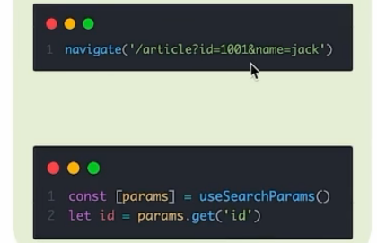


参数发起页面:

```
<Link to='/article?name=liveboy&id=101 '>去往文章页</Link>
```

接收使用页面：

```
import {useSearchParams} from "react-router-dom";
//导入钩子函数

function  Article(){
    const   [params]=useSearchParams() //使用钩子函数 {}进行解构。
    
    let id=params.get('id')
    let name=params.get('name')
    return (<div>
        {name} 和{id}
    </div>)

}

export default Article
```

**使用钩子函数             [params]进行解构**。

 **params的get方法可以调出传递来的参数**


#### /直接写参数 和 useParams钩子函数

参数发起页面:

```
  <Link to='/article/liveboy/101 '>去往文章页</Link>
```

接收使用页面：

```
import {useParams} from "react-router-dom";
function  Article(){
    const params=useParams()
    let id=params.id
    let name=params.name
    return (<div>
        {name} 和{id}
    </div>)

}

export default Article

```

**使用钩子函数useParams           直接获得params**。

 **params.参数名 可以调出传递来的参数**


参数名在哪里？ 是在router文件夹中进行设置。

```
{
        path:'/article/:name/:id',element:<Article />
}
```

/:name/:id  代表了传入两个参数  顺序是先name  再id   

**这里参数名的顺序要和传入的参数值的顺序不能颠倒**！


#### 

### 4  二级路由和默认路由

在router的index处 对一级路径上加入children项

在children中配置二级路径。

```
 {
        path: '/article', 
        element: <Article/>,
        children: [{
            path: 'genshen', element: <Genshen/>

        }, {
            path:'wzry',element:<Wzry></Wzry>
        }]
    }
```

**易错**！！！：

**二级路径的path是没有 / 号的  一旦有会报错。**


在一级页面处导语Outlet包 并使用<Outlet /> **确定二级页面在一级的渲染位置**


```
import {useNavigate} from "react-router-dom";
import {Outlet} from "react-router-dom";
function  Article(){
   const navigate=useNavigate()

    return (<div>
        <div><button onClick={()=>{
            navigate('genshen')
        }}>Game1</button></div>
        <div><button onClick={()=>{
            navigate('Wzry')
        }}>Game2</button></div>
         <Outlet></Outlet>   //确定二级页面的位置 
    </div>)

}

export default Article
```


##### 默认路由：

**如果想要一级页面 一旦加载完毕 就有一个二级页面也随之加载**。

将children中的一个path修改为index。

```
children: [{
           index:true, element: <Genshen/>

        }, {
            path:'wzry',element:<Wzry></Wzry>
        }]
```

这样 <Genshen/>会随着一级页面而加载。

、


### 5 404页面 

**和vue的router很类似  还是* 代表全匹配  写在最下面**

 **因为匹配查找是自上而下的**

写一个叫做Error的page  

在router中导入并将路径设为 '*'  写在最下面。

```
 {
        path:'*',element:<Error/>
  }
```


### 6  两种路由模式

**hash模式和history模式**

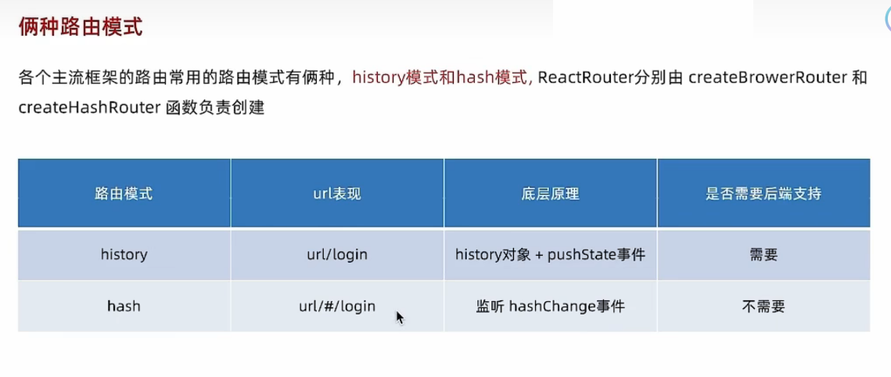


## 16  项目各个组成项规范：

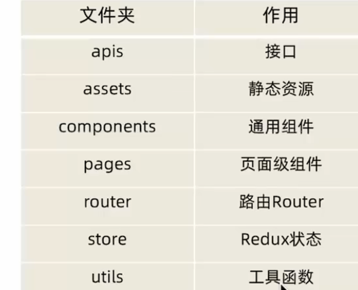


## 17  react项目接入 scss


npm 安装依赖项。

```
npm i sass -D
```


## 18   react 组件库 Ant Design

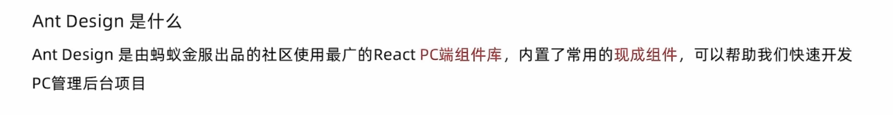


```
 npm install antd --save
```

引入依赖包。


### [说明文档：antdesign](https://ant-design.antgroup.com/components/float-button-cn)


## 19 打包以及打包优化

### 1 项目打包

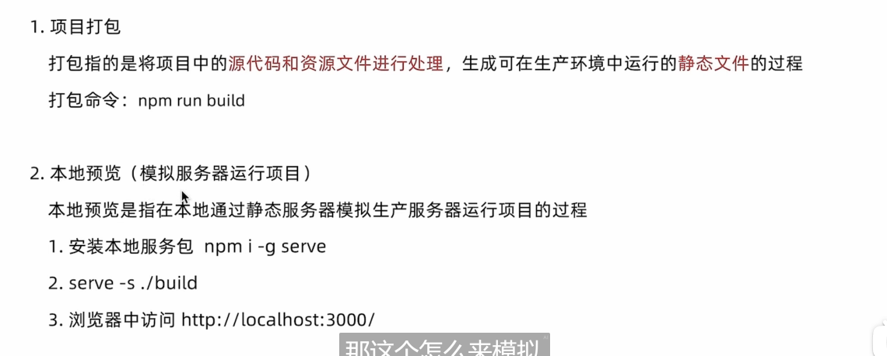


**打包命令：**

```
npm run build
```


**添加本地依赖包：**

```
npm i -g serve
```


**启动：**

```
serve -s ./build
```


### 2 配置路由懒加载：

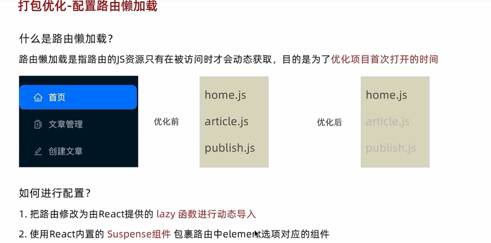


在router 文件夹的index.js中导入lazy和Suspense

```
import React, {Suspense} from "react";
import {lazy} from "react";
```


同时在组件导入时候修改为 lazy(()=>{回调函数})的方法将各个pages导入


最后将router路径中element项做修改

```
element: <Suspense fallback={'正在加载中'}><Genshen/></Suspense>
```

<Suspense fallback={'正在加载中'}>

**fallback中内容是js组件还没被记载完成时候显示的文本**


### 3  CDN优化


**一般将各种依赖包 依赖项放入**