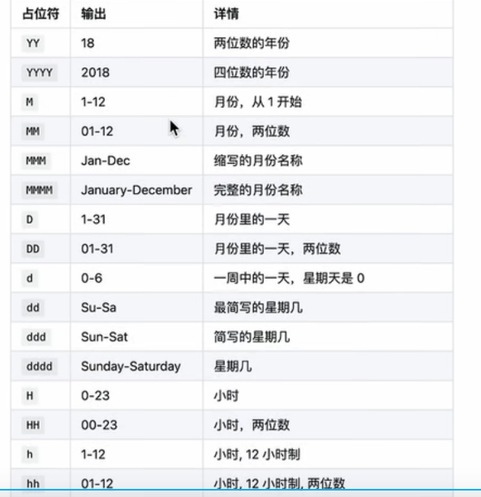
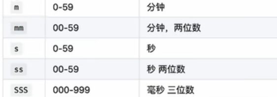
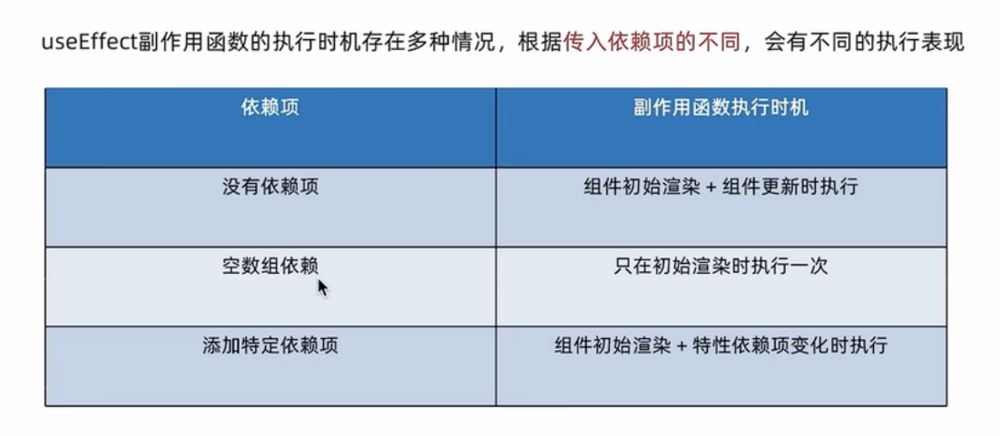

#             react学习

## 1 创建开发环境

**终端创建项目**：

terminal输入

```
npx create-react-app  创建的项目的名字
```


**服务启动:**

terminal输入

```
npm start
```


index.js 文件解析：

```
import React from 'react';
import ReactDOM from 'react-dom/client';
import App from './App';
//导入两个核心包和 app根组件

const root = ReactDOM.createRoot(document.getElementById('root'));
//把名叫app的根组件渲染到id为root的dom节点上

root.render(<App />);
//启动

```

**与v3相比 没有main.js**


## 2    JSX特性

  **在js代码中    也可以编写HTML的模版结构**

 

**他具有HTML的声明式模版的写法 也具有js的可编程能力**


### 1 js表达式的识别

**使用大括号语法 {}  来识别js中表达式**

```
const count=100;

function doubleCount()
{
const Newcount=count*2
return Newcount
}

```


```
function App() {
   return( <div >
    
   {'这是一个APP'}  //识别引号中的字符串
   
   {count} //识别js变量
   
   {doubleCount()} //识别函数调用或者方法调用
   
   <div style={{color:red}}> this is a div！
   </div>
   //第一个大括号是识别js对象 
   //第二个的大括号代表一个对象 内部属性为color:red
   
    </div>)
}
export default App;

```


### 2   map  遍历渲染列表

使用map  直接返回一个html框架即可

例如对下面这个list的渲染

```
const list=[
{name:"lee",age:18,id:1},
{name:"boo",age:19,id:2},
{name:"abe",age:8,id:3},
{name:"lte",age:58,id:4}

]
```


app中遍历渲染 语法如下：

```
function App() {
   
   return(
       <ul>
           {list.map(item => <li key={item.id}>名字是{item.name}</li>)}
       </ul>
   )
}
export default App;
```

注意：

**1 list.map要被{}包裹**

**2 要给 li加上独一无二的key  原因和v中的v-for一样**

 当不使用key时候  在对list增删改查的时候  vue会保留前几项的css样式 

导致增删改查结果不准去

因此要使用

**key属性=‘’唯一标识‘’**（一般是id）

**便于vue进行列表项的正确排序复用**


### 3    &&或三元运算符实现 逻辑控制

```
const flag=false
function App() {
   
   return(
     <div>
         {flag&&<div>我是1号div</div>}
         //使用&&  只有flag为真 才打印后面的html
         
         {flag?<div>我是2号div</div>:<div>我是3号div</div>}
          //使用三元运算符
         
     </div>
   )
}
export default App;

```


### 4 事件绑定

on+事件名称 遵循驼峰命名法 比如onClick

```
function App() {
   
    const  clickfn=(e)=>
    {
        console.log('按钮被点击了')
        console.log(e)
    }
    return(
        <button onClick={clickfn}>请点击</button>
    )
}
export default App;
```


**参数 e 为事件对象** 一般使用e.target 属性。


如果想要带传参 做以下修改：对事件处理函数 clickfn

```
const  clickfn=(自定义参数，e)=>
    {
        console.log('按钮被点击了')
        console.log(e)
         console.log(自定义参数)  
    }
    
    
```


对按钮增添的属性：

```
   <button onClick={(e)=>clickfn(传入的实参,e)}>请点击</button>
```


注意这里不能直接写函数调用 而需要一个函数引用。

**还要注意是先写传入的实参, 再写e  顺序不能乱**


### 5  react的组件化使用

其中的组件实质上就是    function函数 使用<></>直接在另一个 function中插入使用 实现组件化

例如 一个 button 类型的 组件


```
const Button1 =()=>
{   const  clickfn=(e)=>
{
    console.log('按钮被点击了')
    console.log(e.target)

}

    return (
        <button onClick={(e)=>clickfn(e)}>请点击</button>)
}
// function箭头函数 定义了一个叫做Button1的组件


function App() {

 return(
    <div> <Button1></Button1></div>
         //在APP中使用该组件
 )
}


export default App;
```


**注意事项：** **组件名称首字母一定要大写 否则react无法识别 导致无法成功渲染**


### 6 useState 声明 响应式状态量


useState上一个react hook 函数 允许  添加响应式状态量

使用方法：


```
import {useState} from "react";  //先导入react包中的useState

const Button1 =()=>
{
    let [count,setCount]=useState(100) 
    
    //声明list组 第一个参数为响应式变量的名字 第二个为修改状态量的方法  useState传入的参数为初始值。
    
    const  clickfn=(e)=>
{
    setCount(count+1)  //调用修改状态量的方法
    console.log('按钮被点击了')
 

}

    return (
        <button onClick={(e)=>clickfn(e)}>请点击{count}</button>)


}
function App() {

 return(
    <div><Button1></Button1></div>
 )
}
export default App;

```


**修改状态 只能调用set... 的方法**


**如果直接更改 state变量无法实现响应式的效果**


对于复杂对象状态的修改：

```
const Button1 =()=>
{
    let [person,setPerson]=useState({
        name:'lee',
        age:19
    })
    const  clickfn=(e)=>
{
    setPerson({
        ...person,
        name:'boo'
    })

    console.log(person.name)
    console.log('按钮被点击了')


}

    return (
        <button onClick={(e)=>clickfn(e)}>请点击{person.name}</button>)


}
```

**useState 里面传入 {} 包裹的复杂数据对象**


**setState函数修改时候  传入 格式也用 {}包裹**

```
setPerson({

...person,  //先将原来的对象展开
name:'boo'   //同一个key  后定义的value可以覆盖前一个value  故实现了对象的内部属性的修改

})
```


### 

##  3  react的类名对css样式控制


使用独立的 .css文件控制样式

在使用样式的组件js文件中导包：

```
import  './index.css'
```


使用时候不能是 class='...'

而是


```
<div className='......'></div>
```

**在react中用className      去替换原本的class**


## 4 类名控制的优化

**使用classNames函数**

语法：

以tab栏切换的active类名控制为例子;

```
className={classNames('nav-item',{active:type===item.type})}
```

classNames函数实质是返回了一个字符串  

**在函数内部 用{}里面填充判断语句 来展示或者隐藏不固定的样式。**

```
{样式类名:判断语句}
```


## 5 ref获取dom元素


语法和v3很类似

先导包：

```
import {useRef} from "react";
```


再使用：**使用useRef 创建空的ref  再和dom元素绑定**

​               **ref.current 代表所绑定的 dom元素对象**    

```
function App() {
    const textRef = useRef(null)  //先
    const showText = () => {
        console.log(textRef.current.value)
    }
    return (
        <div>
          
            <input type="text" ref={textRef}/>  //绑定
            <button onClick={showText}>获取文本框内容</button>
        </div>

    )
}

export default App;

```


## 6  随机id生成插件和Date格式化插件

#### 随机id生成插件;

安装：

```
npm i uuid
```

导包：

```
import {v4 as uuv4} from 'uuid'
```


使用：

```
uuv4()   //生成一个随机不重复的id
```


#### Date格式化插件

安装：

```
npm i dayjs
```

导包：

```
import dayjs  from 'dayjs'
```

​    

使用：

```
dayjs().format(占位符)
```


占位符使用如下：







## 7      父子组件通信


### 父传子：

类似v3  

父组件使用子组件：

```
function App() {
    const name='leebo'
    return (
        <div>
            <Button1 ex={name}></Button1>
           
      </div>

    )
}
```

格式：

```
ex={要传入的东西}  可以是简单 或者复杂数据类型 或者是fn 甚至是XML语言。
```

**传入了一个把name赋给一个叫做ex的值给子组件**


子组件承接：

子组件的箭头函数内部声明 props 对象  父组件传递的ex就是props对象中的一个属性。

```
const Button1 = (props) => {
   
    return (
        <button>请点击{props.ex}</button>)
 

}
```

使用：{props.ex}


**props是只读  无法在子组件中修改。**


#### 特殊的props  ：props.children

把内容嵌套在子组件标签中   子组件内会自动在叫做children的props属性中接收该内容。

```
function App() {
    const name='leebo'
    return (
        <div>
            <Button1 >
            <div>helllo world </div>  //内容嵌套在子组件标签中
            </Button1>
       </div>

    )
}
```


子组件接受使用：

```
{props.children}
```


### 子传父：

实质是父传递给子组件一个修改方法  子组件通过这个修改方法 去修改父组件的值

```
const Button1 = (props) => {
const  thismsg = 'hello world'
    return(
        <div>
            <button onClick={()=>props.abcChange(thismsg)}>发送给父组件</button>
        </div>
    )

}


function App() {
   const change=(msg)=>
   {
       console.log(msg)
   }

   return(
      <div>
          <Button1 abcChange={change}></Button1>
      </div>
   )
}

export default App;

```

**父亲传递给子组件一个叫做 abcChange的 函数 子组件调用 传递过来的函数  实现对父组件的值传递**。


### 利用父子通信和状态  实现 兄弟组件的通信：

目的  SonA传递信息给SonB

实现思路：

SonA先通过 子传父  传递信息给父组件

在父组件中定义state状态量  将传递过来的值 进行setState

在将这个state 值使用 父传子通信 传递给组件SonB。


## 8  隔代通信

**使用creatContext**

语法：

导包：

```
import {createContext, useContext} from "react";
```

创建实例化Context对象：

```
const msgContext= createContext()
```


在祖先组件中

**使用：<msgContext.Provider value={msg}>**

**</msgContext.Provider> 这对标签包裹住 子组件的标签  value={ } 传入要传递给后代的值**

```
function App() {
const msg='hellowold'

   return(

         <msgContext.Provider value={msg}>
            <div> <Son></Son></div>
         </msgContext.Provider>

   )
}
```


**后代组件使用：useContext(Context的名字)**

```
function SonSon(){

    const msg=useContext(msgContext)  //调用msgContext的value
    return(<div>
        <div>我是SonSon</div>
        <div>{msg}</div>

    </div>)
}
```


## 9 useEffect       

 

用于在react中创建不是 由于事件引起的 而是渲染本身引起的操作：

例如：发送ajex请求 修改dom等等 

导包：

```
import {useEffect} from "react";
```

使用语法：

```
useEffect(()=>{
//执行额外的操作 如发送请求获取数据等等 比如：
async function getData()
{
const res = await fetch(URL)
const jsonRes=await res.json()
}
getData()  //在声明完方法后一定不要忘记调用
},[])
```

第一个参数是一个回调函数

第二个参数**是依赖项参数 数组** 为[]时候 只在渲染的时候执行一次




### useEffect 清除副作用：

比如在useEffect的回调函数中声明了一个 计时器 想要卸载该组件的时候 就要把这个定时器再次清理掉

语法：return()=>{}清除

```
useEffect(()=>{
//执行额外的操作 如发送请求获取数据等等 比如：
const timer = setINterval(()=>{
console.log('hello world')
},1000)


return()=>{
clearInterval(timer)
}

},[])
```


## 10 自定义hook函数

都是要以use开头

封装一些可以复用的逻辑代码 

**将那些需要暴露出去的状态和 回调函数 以对象的形式return出去**

例如：封装一个toggle 对一个flag状态值每次都可以取反

```
function useToggle(){
const [flag,setFlag] =useState(true)

const toggle=()=>{
setFlag(!flag)
}


return{
value,
toggle
  }


}
```

其他组件使用：

```
const {flag,toggle}=useToggle()  //{}解构出来
```


## 11  hook的使用规则

1  只能在组件或者其他的自定义hook函数中使用


2 不能嵌套在if  for 或者其他函数中  只能在组件的最顶层使用。